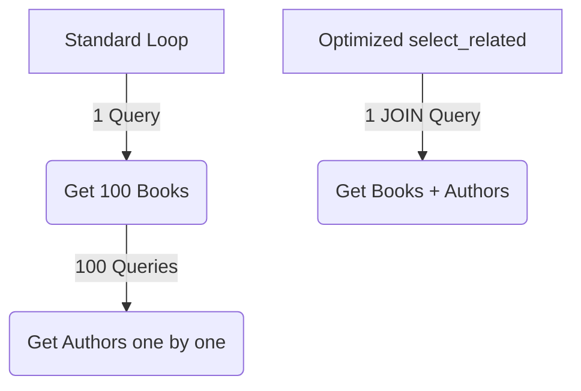

## Formal Definition

Django Query Optimization involves utilizing advanced ORM methods like `select_related` and `prefetch_related` to minimize the number of database queries executed, primarily to resolve the N+1 query problem associated with fetching related objects.

## Explanation

If you query 100 books and then loop through them to print the author's name, Django will execute 1 query for the books, and 100 separate queries for each author. This is the N+1 problem. Query optimization tells Django to fetch the books and authors all at once, reducing the queries from 101 to just 1 or 2.

## How It Works

- **`select_related`**: Uses a SQL `JOIN` to retrieve related data in a single query. Best for "forward" `ForeignKey` or `OneToOneField` relationships.
- **`prefetch_related`**: Executes a separate query for each relationship and does the "joining" in Python memory. Best for `ManyToManyField` or reverse `ForeignKey` relationships.

## Visual Explanation



## Mental Model & Analogy

N+1 problem is like going to the grocery store to buy ingredients for a recipe, but you only buy one ingredient at a time, driving home between each purchase. Query optimization is writing a shopping list and buying everything in a single trip.

## Implementation & Examples

```python
# N+1 Problem
books = Book.objects.all()
for book in books:
    print(book.author.name)  # Hits the DB every loop

# Optimized (1 query via SQL JOIN)
books = Book.objects.select_related('author').all()
for book in books:
    print(book.author.name)  # Uses cached data
```

## Key Properties

- Exclusively solves database round-trip performance bottlenecks.
- `select_related` modifies the SQL query (JOIN).
- `prefetch_related` modifies how Python aggregates the data.

## Connections

- **Built from:** [[django-orm|Django ORM]] — an advanced feature of the ORM.
- **Related:** [[django-model|Django Model]] — optimizes model relationship access.

## Edge Cases & Gotchas

- Using `select_related` on too many relations can create massive, slow SQL JOINs.
- `prefetch_related` consumes more Python memory because it stores all the related objects in RAM.

## Active Recall Questions

> [!question]- Which optimization method uses a SQL JOIN: select_related or prefetch_related?
> `select_related`.

## Sources

- [[django-summary|Source: Django Learning Roadmap]] — performance, ORM mastery
