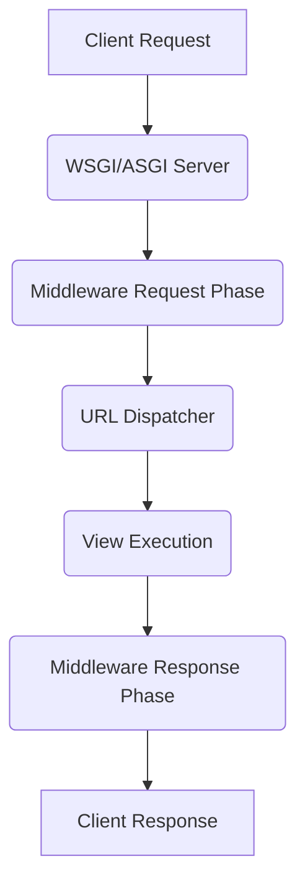

## Formal Definition

The Django Request-Response Lifecycle is the sequence of events and component interactions that occur from the moment a web server receives an HTTP request to the moment it sends an HTTP response back to the client.

## Explanation

It is the path a request takes through the Django framework. Understanding this lifecycle is crucial for debugging and knowing where to intercept or modify requests and responses (e.g., using middleware).

## How It Works

1. The web server (WSGI/ASGI) receives an HTTP request and passes it to Django.
2. Request passes through the Request Middleware layer.
3. The URL Dispatcher matches the requested path to a view.
4. Request passes through the View Middleware layer.
5. The View function/class is executed, optionally interacting with Models and Templates.
6. The View returns an HttpResponse.
7. Response passes back through the Response Middleware layer.
8. The server sends the response to the browser.

## Visual Explanation

## Mental Model & Analogy

Think of it like an assembly line in a factory. The raw material (request) enters the factory, passes through several inspection stations (middleware), gets routed to the correct machine (view) where it is assembled into a product (response), and then passes through final inspections before being shipped out.

## Implementation & Examples

This is a conceptual architecture, implemented internally by Django's `WSGIHandler`.

## Key Properties

- Synchronous by default, but supports async (ASGI).
- Highly extensible via custom middleware.
- Predictable and sequential.

## Connections

- **Built from:** [[django-web-framework|Django Web Framework]] — the overarching system.
- **Related:** [[django-url-dispatcher|Django URL Dispatcher]] — a key step in the lifecycle.
- **Related:** [[django-view|Django View]] — the execution step in the lifecycle.
- **Related:** [[django-model|Django Model]] — accessed during the view step.

## Edge Cases & Gotchas

- Middleware order in `settings.py` is critical. Request phase executes top-down, response phase executes bottom-up.

## Active Recall Questions

> [!question]- In what order does middleware execute during the request and response phases?
> Top-down for requests, bottom-up for responses.

## Sources

- [[django-summary|Source: Django Learning Roadmap]] — request response lifecycle step
