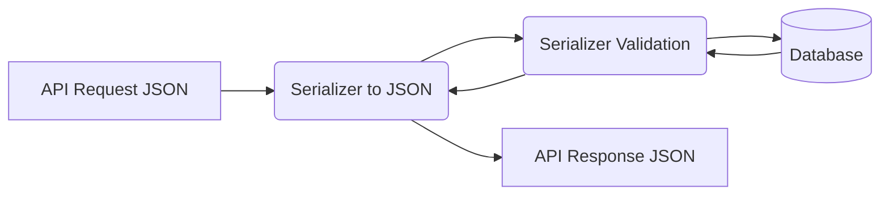

## Formal Definition

Django REST Framework (DRF) is a powerful and flexible third-party toolkit built on top of Django, designed specifically for building Web APIs (Application Programming Interfaces).

## Explanation

Standard Django returns HTML pages intended for human browsers. Modern web development often requires returning raw data (like JSON) so that a React frontend or a mobile app can consume it. DRF provides the tools to serialize Django models into JSON, handle API routing, and manage API authentication.

## How It Works

1. Replaces Django Forms with **Serializers** (which convert QuerySets to JSON and validate incoming JSON).
2. Replaces Django Views with **APIViews** or **ViewSets**.
3. Provides **Routers** to automatically generate standard RESTful URLs.
4. Manages content negotiation, parsing, and rendering automatically.

## Visual Explanation



## Mental Model & Analogy

If standard Django is a restaurant that serves fully plated meals (HTML pages), DRF is a wholesale food supplier that just provides the raw, packaged ingredients (JSON data). The customer (React/Mobile App) takes those ingredients and cooks/presents the meal themselves.

## Implementation & Examples

```python
from rest_framework import serializers, viewsets
from .models import User

# Serializer
class UserSerializer(serializers.ModelSerializer):
    class Meta:
        model = User
        fields = ['url', 'username', 'email']

# ViewSet
class UserViewSet(viewsets.ModelViewSet):
    queryset = User.objects.all()
    serializer_class = UserSerializer
```

## Key Properties

- Browsable API: Provides a web interface to interact with your API out of the box.
- Serializers: Complex data conversion.
- Extensible authentication (JWT, OAuth) and permissions.

## Connections

- **Built from:** [[django-web-framework|Django Web Framework]] — an extension of Django.
- **Related:** [[django-model|Django Model]] — Serializers map to models.
- **Related:** [[django-view|Django View]] — APIViews extend standard views.
- **Related:** [[django-authentication-system|Django Authentication System]] — DRF builds on Django's auth for APIs.

## Edge Cases & Gotchas

- N+1 query problems are very common in DRF Serializers if `select_related` is not used in the ViewSet queryset.

## Active Recall Questions

> [!question]- What component in DRF is roughly equivalent to a Django Form?
> The Serializer (it handles validation and data conversion).

## Sources

- [[django-summary|Source: Django Learning Roadmap]] — serializers, viewsets, API routing
