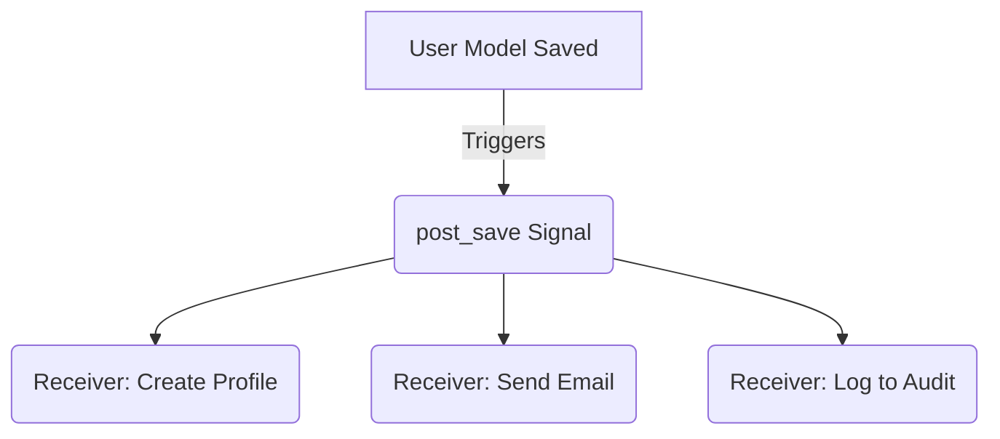

## Formal Definition

Django Signals are a dispatch mechanism that allows decoupled applications get notified when actions occur elsewhere in the framework. They implement the observer pattern, allowing senders to notify a set of receivers.

## Explanation

Sometimes when an event happens (like a user registering), multiple different parts of your system need to react (send a welcome email, create a user profile, log the event). Instead of putting all that code directly in the registration view, signals allow the view to just shout "A user registered!" and let other decoupled functions listen and react independently.

## How It Works

1. A Signal instance is defined (e.g., `post_save`).
2. A receiver function is created and registered to listen to that signal using the `@receiver` decorator.
3. Somewhere in the code, an action occurs and the signal's `.send()` method is triggered.
4. Django synchronously loops through all registered receivers and executes them.

## Visual Explanation



## Mental Model & Analogy

Signals are like a fire alarm in a building. The person who pulls the alarm (sender) doesn't have to go to every room to tell people to leave. The alarm broadcasts the event globally, and everyone (receivers) knows how to react independently.

## Implementation & Examples

```python
from django.db.models.signals import post_save
from django.dispatch import receiver
from .models import User, Profile

@receiver(post_save, sender=User)
def create_user_profile(sender, instance, created, **kwargs):
    if created:
        Profile.objects.create(user=instance)
```

## Key Properties

- Synchronous: Receivers run in the same thread and block the request until they finish.
- Decoupled: Senders and receivers don't need to know about each other.
- Built-in signals: `pre_save`, `post_save`, `pre_delete`, `post_delete`.

## Connections

- **Built from:** [[django-web-framework|Django Web Framework]] — decoupled event system.
- **Related:** [[django-model|Django Model]] — mostly used to listen to model lifecycle events.
- **Contrasts with:** [[django-celery-integration|Django Celery Integration]] — celery is async, signals are sync.

## Edge Cases & Gotchas

- Misconception: People think signals are asynchronous background tasks. They are not. They run sequentially and can drastically slow down an API response.
- Can lead to "spaghetti code" where it's hard to trace why a profile was mysteriously created when a user was saved.