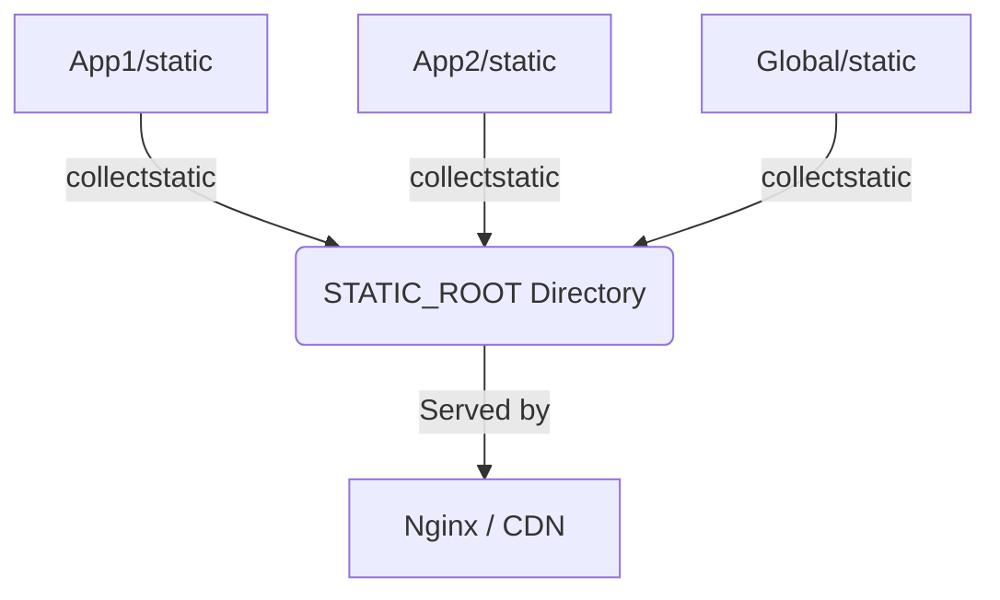

## Formal Definition

Django Static Files represent assets that do not change dynamically per request, such as CSS, JavaScript, and image files, requiring specific configuration for development serving and production deployment.

## Explanation

A web application isn't just HTML; it needs styling (CSS) and interactivity (JS). In development, Django serves these files for you. In production, Django is not designed to serve files (it's inefficient), so it provides a system to gather them into one place for a specialized web server (like Nginx) to handle.

## How It Works

1. Developers place static files in `static/` folders inside their apps.
2. In templates, the `` tag generates the correct URL (`STATIC_URL`).
3. In production, the command `python manage.py collectstatic` is run.
4. Django looks through all apps and copies every static file into a single directory defined by `STATIC_ROOT`.
5. Nginx (or another server/CDN) is configured to serve everything in `STATIC_ROOT`.

## Visual Explanation



## Mental Model & Analogy

Static files are like the paint and furniture of a house. `collectstatic` is like hiring a moving company to gather all the furniture from different warehouses (your apps) and put them all onto a single showroom floor (`STATIC_ROOT`) where customers (browsers) can easily look at them without bothering the architects (Django).

## Implementation & Examples

```html
<!-- In a Django template -->

<link rel="stylesheet" href="">
```

## Key Properties

- `STATIC_URL`: The URL prefix browsers use to request files (e.g., `/static/`).
- `STATIC_ROOT`: The absolute filesystem path where `collectstatic` dumps files.
- `STATICFILES_DIRS`: Additional directories Django should check for static files.


## Visual Explanation


## Semantic Network


## Connections

- **Built from:** [[django-web-framework|Django Web Framework]] -- asset pipeline.
- **Related:** [[django-template-engine|Django Template Engine]] -- templates reference static files.
- **Related:** [[django-deployment-wsgi-gunicorn|Django Deployment]] -- crucial step for going to production.

## Edge Cases & Gotchas

- Misunderstanding the difference between `STATIC_URL` (web address) and `STATIC_ROOT` (hard drive path) is a very common beginner mistake.
- Running Django in production with `DEBUG=False` will immediately break static files if Nginx isn't configured, because Django stops serving them.