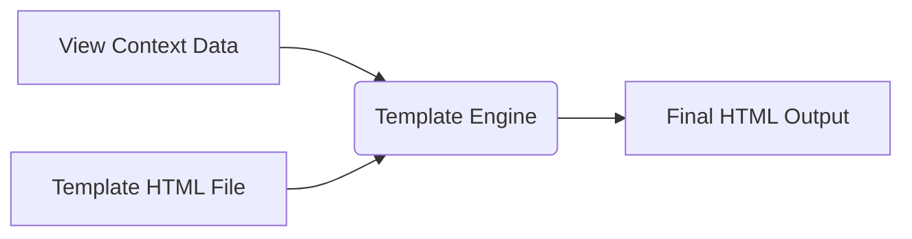

## Formal Definition

The Django Template Engine is a system that allows developers to define dynamically generated HTML responses by combining static HTML structure with dynamic data using a specialized templating language.

## Explanation

Views fetch data, but they shouldn't contain HTML strings directly (that gets messy). Templates are HTML files with special placeholders and logic tags. Django takes the template, injects the data from the view, and renders a final, standard HTML page to send to the browser.

## How It Works

1. A view function gathers context data (a Python dictionary).
2. The view calls `render()` passing the request, template name, and context.
3. The template engine reads the HTML file.
4. It replaces variables `{{ var }}` with actual data.
5. It executes tags ``, `` to control flow.
6. Generates final HTML string.

## Visual Explanation



## Mental Model & Analogy

A template is like a form letter (mad libs). The structure of the letter is static, but there are blank spaces for "Name", "Date", and "Amount". The Template Engine is the secretary who takes a list of names and fills out the blank spaces to create individualized letters.

## Implementation & Examples

```html
<!-- template.html -->
<h1>Welcome, {{ user.name }}!</h1>
<ul>

    <li>{{ item }}</li>

</ul>
```

## Key Properties

- Uses `{{ }}` for variables and `` for tags.
- Supports template inheritance (DRY principle).
- Intentionally restricts execution of arbitrary Python code to enforce separation of logic and presentation.

## Connections

- **Built from:** [[django-view|Django View]] — views render templates.
- **Related:** [[django-web-framework|Django Web Framework]] — the built in UI layer.
- **Related:** [[django-app|Django App]] — templates are usually stored in app directories.
- **Related:** [[django-rest-framework|Django REST Framework]] — an alternative to templates when building APIs.

## Edge Cases & Gotchas

- Complex business logic should not reside in templates. If it requires complex filtering or calculation, do it in the View or Model.

## Active Recall Questions

> [!question]- Why doesn't Django allow executing arbitrary Python code inside templates?
> To enforce separation of concerns, keeping business logic in views/models and only presentation logic in templates.

## Sources

- [[django-summary|Source: Django Learning Roadmap]] — template variables, tags, and inheritance
