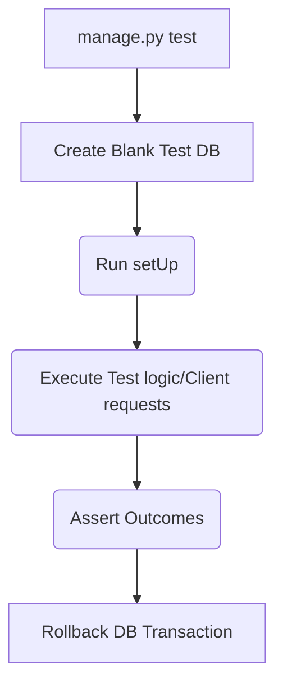

## Formal Definition

The Django Testing Framework is a suite of tools built on top of Python's `unittest` module that provides specialized test cases, a test client for simulating HTTP requests, and automatic database isolation for verifying application behavior.

## Explanation

Writing code is only half the battle; proving it works and won't break later is the other half. Django provides tools to simulate users clicking around your site, logging in, submitting forms, and checking the database to ensure everything behaves exactly as expected.

## How It Works

1. Tests are written as methods inside classes inheriting from `django.test.TestCase`.
2. Running `python manage.py test` creates a brand new, empty "test database".
3. For each test, Django runs the `setUp()` method, executes the test, and then destroys the data to ensure isolation.
4. The `self.client` object acts as a fake browser to make GET and POST requests.
5. Assertions (e.g., `assertEqual`) verify responses, status codes, and database state.

## Visual Explanation



## Mental Model & Analogy

Testing is like a crash test facility for cars. You set up the dummy (setUp data), you crash the car into a wall (simulate request), and you measure the sensors to see if the airbags deployed correctly (assertions). Then you sweep away the debris (database rollback) and prepare the next car.

## Implementation & Examples

```python
from django.test import TestCase
from .models import Item

class ItemModelTest(TestCase):
    def test_saving_and_retrieving_items(self):
        Item.objects.create(name="Test Item")
        
        saved_items = Item.objects.all()
        self.assertEqual(saved_items.count(), 1)
        self.assertEqual(saved_items[0].name, "Test Item")
```

## Key Properties

- Automatic database rollback per test ensures zero cross-test contamination.
- Built-in `Client` can simulate authentication and session states.
- Follows the standard Arrange-Act-Assert pattern.

## Connections

- **Built from:** [[python-programming-language|Python]] — extends `unittest`.
- **Related:** [[django-web-framework|Django Web Framework]] — deeply integrated test runner.
- **Related:** [[django-model|Django Model]] — testing model logic.
- **Related:** [[django-view|Django View]] — testing view responses.

## Edge Cases & Gotchas

- If your code communicates with an external API (like Stripe), your tests will actually hit the real API and charge money unless you use "Mocking" to fake the external response.