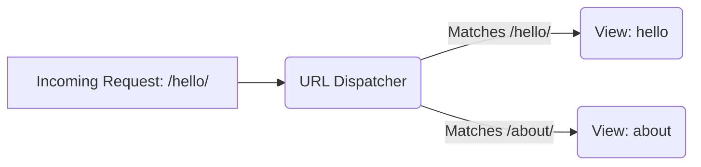

## Formal Definition

The Django URL Dispatcher is a mechanism that routes incoming HTTP requests to the appropriate view function or class based on pattern matching of the requested URL.

## Explanation

When a request hits a Django server, it needs to know what code should handle it. The URL dispatcher is like a receptionist mapping the URL path (e.g., `/students/15`) to a specific python function (a view) that knows how to generate the response.

## How It Works

1. Django looks at the `ROOT_URLCONF` setting to find the root `urls.py`.
2. It iterates through the `urlpatterns` list in order.
3. It tries to match the requested URL against each pattern (using `path()` or `re_path()`).
4. Upon the first match, it imports and calls the associated view function, passing the request and any captured URL parameters.

## Visual Explanation



## Mental Model & Analogy

Think of the URL Dispatcher as a switchboard operator or a mail sorter. It looks at the address on the envelope (the URL) and routes it to the correct department (the view) to be processed.

## Implementation & Examples

```python
from django.urls import path
from . import views

urlpatterns = [
    path("hello/", views.hello),
]
```

## Key Properties

- Evaluated top-to-bottom: The first matching pattern wins.
- Supports path converters: Can capture variables from URLs (e.g., `<int:id>`).
- Supports namespaces: Allows apps to have isolated URL names.

## Connections

- **Built from:** [[django-web-framework|Django Web Framework]] — core component of the framework.
- **Builds into:** [[django-view|Django View]] — routes requests to views.
- **Related:** [[django-request-response-lifecycle|Django Request-Response Lifecycle]] — it is the first step in the lifecycle.
- **Related:** [[django-project|Django Project]] — configured at the project level.

## Edge Cases & Gotchas

- Forgetting the trailing slash can cause unexpected 404s depending on the `APPEND_SLASH` setting.
- Overlapping patterns: A broad pattern at the top might accidentally catch URLs meant for patterns below it.

## Active Recall Questions

> [!question]- Which component decides which View should handle an incoming request?
> The URL Dispatcher.

## Sources

- [[django-summary|Source: Django Learning Roadmap]] — routing mechanism and lifecycle
