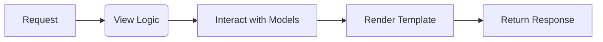
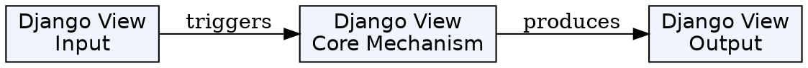
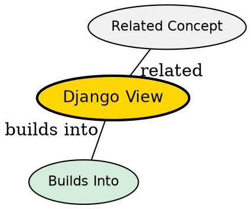

## Formal Definition

A Django View is a Python function or class that takes an HTTP request and returns an HTTP response, encapsulating the business logic required to fulfill the request.

## Explanation

The view is the brain of a specific page or API endpoint. It takes the request from the URL dispatcher, figures out what data is needed, fetches it from the database, and decides what to send back to the user (like an HTML page or JSON data).

## How It Works

1. Receives an `HttpRequest` object from the URL dispatcher as its first argument.
2. Extracts any necessary parameters, form data, or user context.
3. Interacts with the ORM (Models) to read or write to the database.
4. Constructs an `HttpResponse` object (or subclass like `JsonResponse`).
5. Returns the response back through the middleware to the client.

## Visual Explanation



## Mental Model & Analogy

Think of a View as a chef in a restaurant. The waiter (URL Dispatcher) brings the order (Request). The chef reads the order, gathers ingredients from the pantry (Model/Database), cooks the meal (business logic), and gives it back to the waiter on a plate (Response).

## Implementation & Examples

```python
from django.http import HttpResponse

def hello(request):
    return HttpResponse("Hello Django!")
```

## Key Properties

- Must accept a request object as the first parameter.
- Must return an HttpResponse object (or raise an exception).
- Can be function-based (FBV) or class-based (CBV).


## Visual Explanation



## Semantic Network


## Connections

- **Built from:** [[django-web-framework|Django Web Framework]] -- the logic center.
- **Builds into:** [[django-class-based-view|Django Class Based View]] -- a more advanced, object-oriented way to write views.
- **Related:** [[django-url-dispatcher|Django URL Dispatcher]] -- calls the view.
- **Related:** [[django-model|Django Model]] -- views query models for data.

## Edge Cases & Gotchas

- Forgetting to return a response object will cause an error.
- Putting too much logic in the view (Fat Views) makes code hard to maintain; logic should often be pushed to the model or service layer.