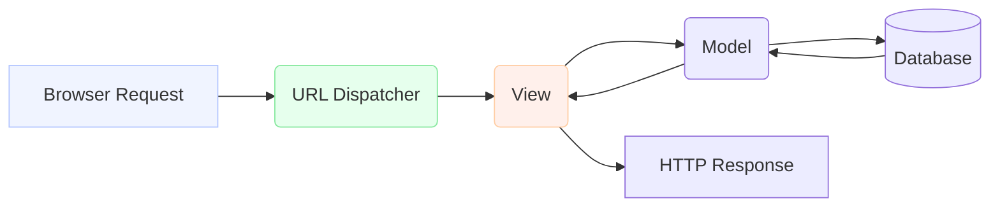

## Formal Definition

Django is a high-level Python web framework used to build server-side web applications, encouraging rapid development and clean, pragmatic design.

## Explanation

Instead of writing each component from scratch, Django provides built-in modules for URL routing, authentication, database interaction, forms, security, and more. It allows developers to focus on writing their app without needing to reinvent the wheel.

## How It Works

1. A browser sends an HTTP request to the server.
2. The URL Dispatcher matches the URL and forwards it to the appropriate View.
3. The View processes the business logic.
4. If data is needed, the View interacts with the Database through the Model.
5. The View returns an HTTP Response (HTML, JSON, etc.) back to the browser.

## Visual Explanation



## Mental Model & Analogy

Think of Django as a pre-built house where the plumbing, wiring, and foundation are already set up. You just need to furnish the rooms and decide what each room is used for, rather than building the house from scratch brick by brick.

## Implementation & Examples

To create a new Django project:
```bash
django-admin startproject myproject
```

## Key Properties

- Batteries included: Provides everything needed for a common web backend.
- High-level: Abstracts away low-level network and database protocols.
- Python-based: Leverages the Python ecosystem.

## Connections

- **Built from:** [[python-programming-language|Python]] — Django is built entirely in Python.
- **Builds into:** [[django-project|Django Project]] — the framework is used to instantiate projects.
- **Related:** [[django-request-response-lifecycle|Django Request-Response Lifecycle]] — the core execution flow of Django.
- **Related:** [[django-rest-framework|Django REST Framework]] — an extension of Django for APIs.

## Edge Cases & Gotchas

- Can be overkill for very small microservices.
- Has a steeper learning curve initially due to its "magic" and strict conventions.