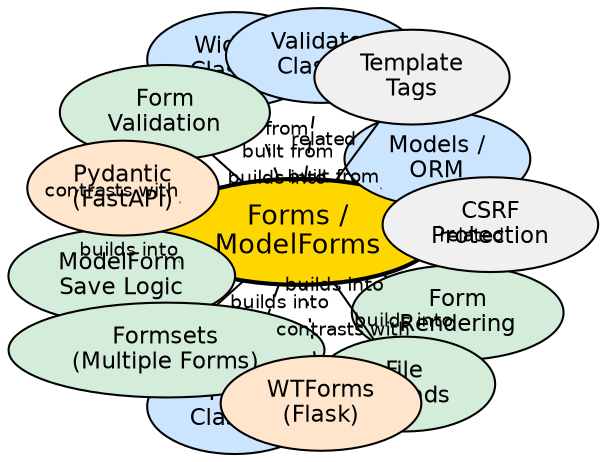

## Formal Definition

Django Forms (`django.forms.Form`) provide a declarative way to define validation logic, rendering, and data cleaning for user input, while ModelForms (`django.forms.ModelForm`) automatically generate form fields from a model's field definitions, handling model instance creation and updates through `form.save()`.

## Explanation

Forms solve the problem of safely handling user input — validating, sanitizing, and converting raw HTTP POST data into structured Python objects. A Form declares fields with validators and widgets; on submission, `form.is_valid()` runs field cleaning (`clean_<field>()`), form-level cleaning (`clean()`), and returns cleaned data. ModelForms extend this by mapping form fields to model fields, enabling `form.save()` to create or update model instances atomically.

## How It Works

1. **Form defined** — Class with field instances (`CharField`, `EmailField`, `ModelChoiceField`, etc.)
2. **GET request** — View instantiates empty form; template renders `{{ form.as_p }}` or manual `{{ field }}`
3. **POST request** — View instantiates `Form(request.POST)` (and `request.FILES` for uploads)
4. **Validation runs** — `is_valid()` calls `full_clean()` → field `clean()` → `clean_<field>()` → `clean()`
5. **Cleaned data** — `form.cleaned_data` dict available if valid
6. **Save/Model save** — `form.save()` creates/updates model (ModelForm) or custom logic (Form)

## Visual Explanation

```dot
digraph forms_modelforms {
  rankdir=TB;
  node [shape=box style=filled fillcolor="#f0f4ff" fontname="Helvetica" fontsize=10];

  FormClass [label="class BookForm(ModelForm):\n    class Meta:\n        model = Book\n        fields = ['title', 'author']" fillcolor="#ffe5cc"];
  GETView [label="GET: form = BookForm()\nrender(template, {'form': form})"];
  Template [label="{{ form.as_p }}\n→ <input name='title'>\n<select name='author'>"];
  POSTView [label="POST: form = BookForm(request.POST)\nif form.is_valid():\n    book = form.save()"];
  Validation [label="full_clean()\n1. Field clean()\n2. clean_title()\n3. clean()"];
  ModelSave [label="form.save()\n→ Book.objects.create(...)\nOR book.save()" fillcolor="#d4edda"];

  FormClass -> GETView [label="1. Instantiate"];
  GETView -> Template [label="2. Render"];
  Template -> POSTView [label="3. Submit POST"];
  POSTView -> Validation [label="4. Validate"];
  Validation -> ModelSave [label="5. Save if valid"];
}
```

## Semantic Network

## Key Properties

- **Field types**: `CharField`, `IntegerField`, `EmailField`, `ChoiceField`, `ModelChoiceField`, `ModelMultipleChoiceField`, `FileField`, `ImageField`, `DateTimeField`, `BooleanField`
- **Widgets control rendering**: `TextInput`, `Textarea`, `Select`, `CheckboxSelectMultiple`, `HiddenInput`, `DateTimeInput` — customize HTML attributes
- **Validation layers**: Field `clean()` (type/format) → `clean_<field>()` (field-specific) → `clean()` (cross-field) → `cleaned_data`
- **ModelForm Meta**: `model`, `fields`/`exclude`, `widgets`, `labels`, `help_texts`, `error_messages`, `field_classes`
- **`save(commit=False)`**: Returns unsaved instance for pre-save modification (e.g., set `author=request.user`)

## Connections

- Built from: [[models-orm|Models/ORM]] — ModelForm introspects model fields
- Built from: [[form-fields|Form Fields]] — Field definitions and validation
- Built from: [[widgets|Widgets]] — HTML rendering customization
- Built from: [[validators|Validators]] — Reusable validation logic
- Builds into: [[form-validation|Form Validation]] — Multi-layer cleaning pipeline
- Builds into: [[modelform-save|ModelForm Save Logic]] — `save()`, `save(commit=False)`
- Builds into: [[form-rendering|Form Rendering]] — `as_p`, `as_table`, `as_ul`, manual `{{ field }}`
- Builds into: [[formsets|Formsets]] — Multiple forms on one page
- Builds into: [[file-uploads|File Uploads]] — `FileField`, `ImageField`, `request.FILES`
- Contrasts with: [[wtforms|WTForms]] — Flask's form library, similar but separate
- Contrasts with: [[pydantic|Pydantic]] — FastAPI's validation, type-hint based, no HTML rendering
- Related: [[csrf-protection|CSRF Protection]] — `` required for POST forms
- Related: [[form-template-tags|Form Template Tags]] — `{{ form.errors }}`, `{{ field.label_tag }}`

## Edge Cases & Gotchas

- **`clean()` vs `clean_<field>()`**: `clean()` runs after all field cleaning; `cleaned_data` may be incomplete if field errors exist
- **ModelForm `exclude` vs `fields`**: `fields = '__all__'` includes future model fields (security risk); explicit `fields` preferred
- **`save(commit=False)`**: Must call `instance.save()` manually; M2M needs `form.save_m2m()` after
- **File uploads**: Need `enctype="multipart/form-data"` on `<form>`; `request.FILES` separate from `request.POST`
- **Formset management form**: Hidden `TOTAL_FORMS`, `INITIAL_FORMS` required; `can_delete=True` adds `DELETE` checkbox