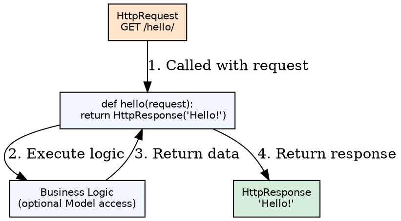
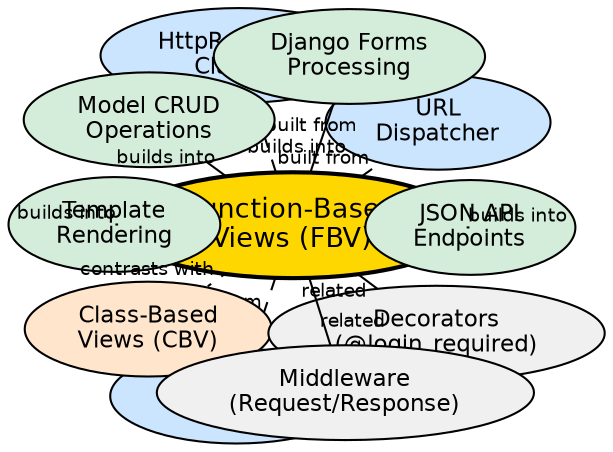

## Formal Definition

A Function-Based View (FBV) is a Python callable that accepts an `HttpRequest` object as its first parameter and returns an `HttpResponse` object, implementing request-handling logic directly in a function body with explicit control over HTTP methods, status codes, and response content.

## Explanation

FBVs are Django's original and most direct view pattern — a plain Python function that receives a request and returns a response. They provide complete control over the request/response cycle, making them ideal for simple endpoints, custom logic that doesn't fit generic patterns, and developers who prefer explicit over implicit behavior. Each HTTP method (GET, POST, etc.) is handled with explicit `if request.method == 'POST':` checks.

## How It Works

1. **URL pattern matches** — URL dispatcher resolves path to view function
2. **Request object created** — Django builds `HttpRequest` with `GET`, `POST`, `FILES`, `COOKIES`, `session`, `user`
3. **View function called** — `view_func(request, *args, **kwargs)` executed
4. **Business logic runs** — Query models, process forms, call services, etc.
5. **Response returned** — `HttpResponse`, `JsonResponse`, `render()`, `redirect()`, or `HttpResponseNotFound`
6. **Middleware processes response** — Response middleware modifies headers, compresses, etc.

## Visual Explanation

## Semantic Network

## Key Properties

- **Explicit control**: Every line of logic visible; no hidden inheritance chains
- **Method handling**: Manual `if request.method == 'POST':` branching
- **Decorator composition**: `@require_http_methods`, `@login_required`, `@csrf_exempt` stack cleanly
- **Testability**: Easy to unit test — call function with mock request, assert response
- **Flexibility**: Can return any `HttpResponse` subclass; stream, file, JSON, redirect

## Connections

- Built from: [[url-dispatcher|URL Dispatcher]] — Receives matched requests
- Built from: [[http-request|HttpRequest Object]] — Input parameter
- Built from: [[http-response|HttpResponse Classes]] — Return types
- Builds into: [[forms-modelforms|Forms/ModelForms Processing]] — Handle form submission
- Builds into: [[models-orm|Model CRUD Operations]] — Create/read/update/delete
- Builds into: [[template-engine|Template Rendering]] — `render(request, template, context)`
- Contrasts with: [[class-based-views|Class-Based Views]] — Implicit behavior via inheritance
- Related: [[view-decorators|View Decorators]] — Cross-cutting concerns (auth, CSRF, methods)
- Related: [[middleware|Middleware]] — Global request/response processing

## Edge Cases & Gotchas

- **CSRF protection**: POST forms need `` or `@csrf_exempt` (dangerous)
- **Method safety**: Forgetting to check `request.method` leads to GET-side effects
- **Code duplication**: Similar CRUD views repeat boilerplate; CBVs/DRF reduce this
- **Large functions**: Complex views become hard to maintain; split into services/helpers

## Sources

- [[django-summary|Django Learning Roadmap]]