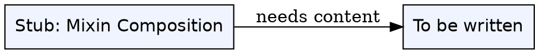

## The Problem

Auto-created stub for singleton broken link `[[mixin-composition]]` -- referenced once and was missing. Keeps graph connected per `AGENTS.md:199`.

## Formal Definition

Per Wikipedia: "To be written."

## Explanation

Stub -- fill with plain language explanation of mixin composition.

## How It Works

1. To be written.
2. To be written.
3. To be written.
4. To be written.

## Visual Explanation



## Semantic Network


## Key Properties

- To be written.

## Real-World Example

```python
# TODO: add example for Mixin Composition
```

## Connections

- **Related:** [[index|Index]] -- auto stub for singleton `[[mixin-composition]]` from `wiki/django/class-based-views.md`

## Edge Cases & Gotchas

- To be written.
- To be written.
