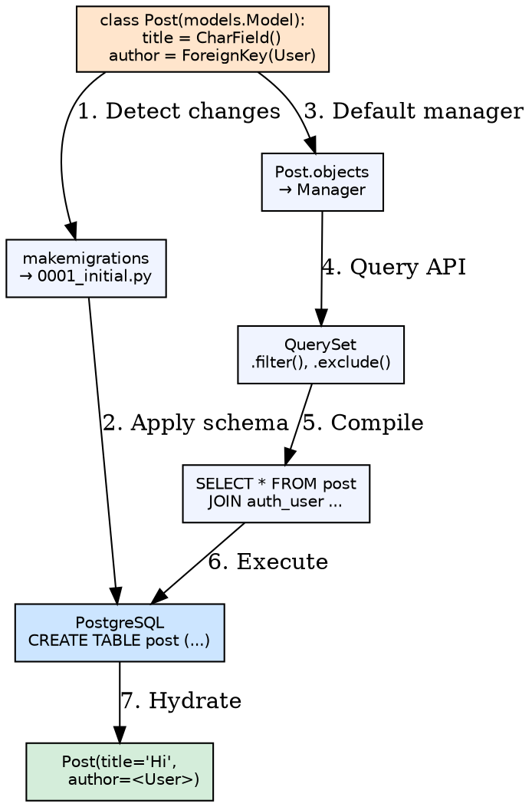
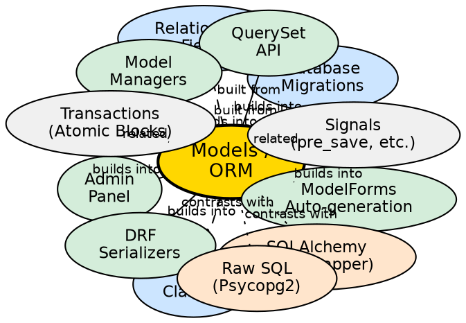

## Formal Definition

Django Models define the structure and behavior of application data as Python classes inheriting from `django.db.models.Model`, where each class attribute represents a database field, and the ORM (Object-Relational Mapper) translates Python operations (create, filter, save, delete) into SQL queries against a relational database.

## Explanation

The Models/ORM layer solves the impedance mismatch between Python objects and relational tables. Instead of writing SQL, developers define fields (`CharField`, `IntegerField`, `ForeignKey`, `ManyToManyField`) with constraints (`null`, `blank`, `unique`, `choices`), and Django handles schema creation (migrations), query generation, and object hydration. The ORM supports relationships, aggregation, annotation, and raw SQL escape hatches.

## How It Works

1. **Model defined** — Python class with field instances as class attributes
2. **Migration created** — `makemigrations` inspects model changes, generates schema operations
3. **Migration applied** — `migrate` executes SQL (CREATE TABLE, ALTER TABLE) on database
3. **Query issued** — `Model.objects.filter(...)` returns lazy `QuerySet`
4. **SQL generated** — QuerySet compiles to SELECT with JOINs for relationships
5. **Results hydrated** — Rows converted to model instances (or dicts via `.values()`)
6. **Instance saved** — `instance.save()` generates INSERT or UPDATE

## Visual Explanation

## Semantic Network

## Key Properties

- **Field types map to SQL**: `CharField`→VARCHAR, `IntegerField`→INTEGER, `DateTimeField`→TIMESTAMP
- **Relationships**: `ForeignKey` (many-to-one), `ManyToManyField`, `OneToOneField` with `on_delete` behavior
- **Meta options**: `db_table`, `ordering`, `indexes`, `constraints`, `unique_together`, `verbose_name`
- **Managers**: `objects = Manager()` customizes default queryset; `QuerySet.as_manager()` for chainable managers
- **Deferred loading**: `.only()`, `.defer()` control field selection; `select_related`/`prefetch_related` for JOINs

## Connections

- Built from: [[database-migrations|Database Migrations]] — Schema sync mechanism
- Built from: [[model-fields|Model Fields]] — Field type definitions
- Built from: [[relationship-fields|Relationship Fields]] — FK, M2M, O2O
- Builds into: [[orm-querysets|QuerySet API]] — Filter, annotate, aggregate
- Builds into: [[model-managers|Model Managers]] — Custom query entry points
- Builds into: [[admin-panel|Admin Panel]] — Auto-registers models
- Builds into: [[forms-modelforms|ModelForms]] — Form generation from model
- Builds into: [[django-rest-framework-serializers|DRF Serializers]] — `ModelSerializer`
- Contrasts with: [[sqlalchemy|SQLAlchemy]] — Data Mapper pattern, explicit session, more flexible
- Contrasts with: [[raw-sql|Raw SQL]] — Full control, no abstraction overhead
- Related: [[transactions|Database Transactions]] — `atomic()` blocks
- Related: [[model-signals|Model Signals]] — `pre_save`, `post_delete`, `m2m_changed`

## Edge Cases & Gotchas

- **N+1 queries**: Accessing `post.author.name` in loop → use `select_related('author')`
- **M2M through table**: `ManyToManyField` creates hidden table; `through=` for custom intermediate model
- **Default mutable**: `default=[]` shares list across instances; use `default=list` or `default=lambda: []`
- **Migration reversibility**: `RunSQL`/`RunPython` need reverse code; data migrations can break rollback
- **Abstract base classes**: `abstract = True` in Meta prevents table creation; fields inherited