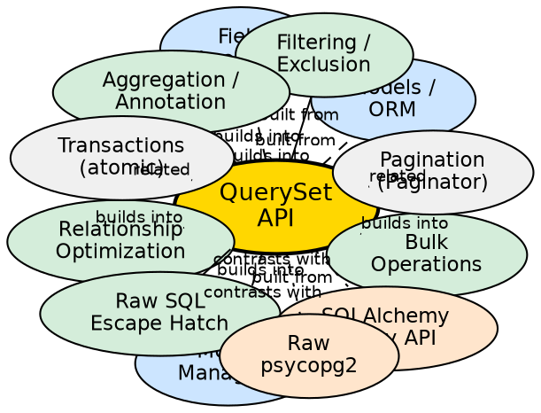

## Formal Definition

A QuerySet is a lazy, chainable collection of database queries represented by `django.db.models.QuerySet`, providing methods for filtering (`filter`, `exclude`), ordering (`order_by`), slicing, aggregation (`aggregate`, `annotate`), and relationship traversal (`select_related`, `prefetch_related`) that only executes SQL when evaluated.

## Explanation

The QuerySet API solves the problem of building complex database queries programmatically without writing raw SQL. It uses lazy evaluation — chaining `.filter().exclude().order_by()` builds an internal query plan but executes no SQL until iteration, `list()`, `len()`, `bool()`, or explicit `.all()`. This allows dynamic query composition based on runtime conditions while deferring expensive database round-trips.

## How It Works

1. **Manager access** — `Model.objects` returns a `Manager` with base `QuerySet`
2. **Chaining filters** — Each method returns new `QuerySet` with modified `query` attribute
3. **Query compilation** — On evaluation, `QuerySet.query` compiles to SQL via `SQLCompiler`
4. **SQL execution** — Database cursor executes; rows fetched
5. **Result hydration** — Rows converted to model instances (or dicts/values_list tuples)
6. **Caching** — Evaluated QuerySet caches results; re-iteration uses cache

## Visual Explanation

## Semantic Network

## Key Properties

- **Laziness**: No SQL until evaluation; `qs = Post.objects.all()` hits DB zero times
- **Immutability**: Each method returns new QuerySet; original unchanged
- **Caching**: First evaluation populates `_result_cache`; subsequent use cached
- **Field lookups**: `field__lookup` syntax — `exact`, `iexact`, `contains`, `icontains`, `gt`, `gte`, `lt`, `lte`, `in`, `startswith`, `endswith`, `range`, `date`, `year`, `month`, `day`, `isnull`, `regex`
- **Optimization**: `select_related` (FK, O2O → JOIN), `prefetch_related` (M2M, reverse FK → separate query + Python join)

## Connections

- Built from: [[models-orm|Models/ORM]] — QuerySet operates on model tables
- Built from: [[model-managers|Model Managers]] — Entry point via `Model.objects`
- Built from: [[field-lookups|Field Lookups]] — `__` syntax for filters
- Builds into: [[filtering-exclusion|Filtering/Exclusion]] — `filter()`, `exclude()`, `Q()` objects
- Builds into: [[aggregation-annotation|Aggregation/Annotation]] — `aggregate()`, `annotate()`, `Count`, `Sum`, `Avg`
- Builds into: [[relationship-optimization|Relationship Optimization]] — `select_related`, `prefetch_related`
- Builds into: [[bulk-operations|Bulk Operations]] — `bulk_create`, `bulk_update`, `update()`, `delete()`
- Contrasts with: [[sqlalchemy-query|SQLAlchemy Query]] — Explicit session, more flexible joins
- Contrasts with: [[raw-sql|Raw SQL]] — Full control, no ORM overhead
- Related: [[database-transactions|Transactions]] — `atomic()` for multi-query atomicity
- Related: [[pagination|Pagination]] — `Paginator` slices QuerySet for pages

## Edge Cases & Gotchas

- **QuerySet cloning**: `qs.filter(...)` returns new QuerySet; modifying `qs` in place doesn't work
- **Slicing evaluates**: `qs[:10]` executes SQL with `LIMIT`; `qs[5:10]` uses `OFFSET`/`LIMIT`
- **`len(qs)` vs `qs.count()`**: `len()` evaluates and caches; `count()` always does `SELECT COUNT(*)`
- **`exists()` vs `bool(qs)`**: `exists()` does `SELECT 1 ... LIMIT 1`; `bool()` evaluates full QuerySet
- **M2M `filter()` vs `exclude()`**: `Post.objects.filter(tags__name='django')` vs `exclude(tags__name='django')` — `exclude` matches posts with NO matching tags, not posts where ALL tags don't match