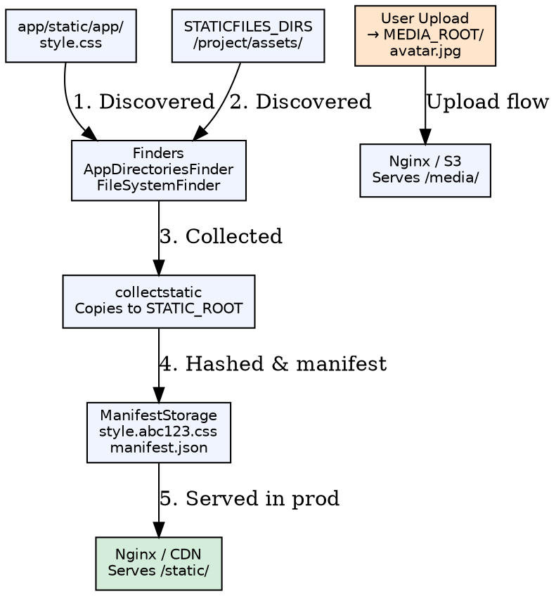

## Formal Definition

Django's Static Files system (`django.contrib.staticfiles`) manages project-level and app-level static assets (CSS, JS, images) through finders, a manifest-based storage for cache-busting, and the `collectstatic` command, while Media Files handle user-uploaded content via `MEDIA_ROOT`/`MEDIA_URL` with separate serving configuration for development and production.

## Explanation

Static and media files solve different problems: static files are developer-provided assets (stylesheets, scripts, logos) that are version-controlled and cacheable, while media files are user-generated uploads (avatars, documents) that must be stored securely and served efficiently. In development, Django serves both; in production, a web server (Nginx) or CDN serves static files directly, while media files may use cloud storage (S3) or a protected media server.

## How It Works

1. **Static files declared** — `STATIC_URL = '/static/'`, `STATIC_ROOT = BASE_DIR / 'staticfiles'`
2. **App static dirs** — Each app's `static/app_name/` auto-discovered by `AppDirectoriesFinder`
3. **Project static dirs** — `STATICFILES_DIRS` for project-wide assets
4. **Template tag** — `` → `` → `/static/css/style.css`
5. **Collectstatic** — `python manage.py collectstatic` copies all found files to `STATIC_ROOT`
6. **Manifest storage** — `ManifestStaticFilesStorage` renames files with content hash (`style.abc123.css`)
7. **Media files** — `MEDIA_URL = '/media/'`, `MEDIA_ROOT = BASE_DIR / 'media'`; uploads saved to `MEDIA_ROOT`

## Visual Explanation



## Semantic Network

```dot
graph semantic_static_media_files {
  layout=neato;
  node [shape=ellipse fontname="Helvetica" fontsize=11 style=filled];
  edge [fontname="Helvetica" fontsize=9];

  THIS [label="Static /\nMedia Files" fillcolor="#ffd700" fontsize=13 style="filled,bold"];

  PRE1 [label="Template\nEngine" fillcolor="#cce5ff"];
  PRE2 [label="File\nStorage API" fillcolor="#cce5ff"];
  PRE3 [label="Settings\nConfiguration" fillcolor="#cce5ff"];

  OUT1 [label="collectstatic\nCommand" fillcolor="#d4edda"];
  OUT2 [label="Manifest\nStorage" fillcolor="#d4edda"],
  OUT3 [label="FileField /\nImageField" fillcolor="#d4edda"];
  OUT4 [label="WhiteNoise\n(WSGI Static)" fillcolor="#d4edda"];

  CON1 [label="Flask\nstatic folder" fillcolor="#ffe5cc"];
  CON2 [label="FastAPI\nStaticFiles" fillcolor="#ffe5cc"];

  REL1 [label="Template\n" fillcolor="#f0f0f0"];
  REL2 [label="Forms\nFile Upload" fillcolor="#f0f0f0"];

  THIS -- PRE1 [label="built from" style=dashed];
  THIS -- PRE2 [label="built from" style=dashed];
  THIS -- PRE3 [label="built from" style=dashed];
  THIS -- OUT1 [label="builds into"];
  THIS -- OUT2 [label="builds into"];
  THIS -- OUT3 [label="builds into"];
  THIS -- OUT4 [label="builds into"];
  THIS -- CON1 [label="contrasts with" style=dotted];
  THIS -- CON2 [label="contrasts with" style=dotted];
  THIS -- REL1 [label="related"];
  THIS -- REL2 [label="related"];
}
```

## Key Properties

- **Finders**: `FileSystemFinder` (STATICFILES_DIRS), `AppDirectoriesFinder` (app/static/), `DefaultStorageFinder`
- **Storages**: `FileSystemStorage` (local), `ManifestStaticFilesStorage` (hashed names), `S3Boto3Storage` (cloud)
- **`collectstatic`**: `--clear` removes stale files; `--dry-run` previews; `--no-input` for CI
- **Development serving**: `django.conf.urls.static.static()` adds URL patterns only if `DEBUG=True`
- **Media security**: Never serve user uploads directly in production without validation; use signed URLs or auth checks

## Connections

- Built from: [[template-engine|Template Engine]] — `` tag resolves paths
- Built from: [[file-storage-api|File Storage API]] — Abstract storage backends
- Built from: [[settings-configuration|Settings Configuration]] — STATIC/MEDIA settings
- Builds into: [[collectstatic-command|collectstatic Command]] — Deployment step
- Builds into: [[manifest-storage|Manifest Storage]] — Cache-busting via content hash
- Builds into: [[filefield-imagefield|FileField/ImageField]] — Model fields for uploads
- Builds into: [[whitenoise|WhiteNoise]] — WSGI middleware for static serving
- Contrasts with: [[flask-static|Flask Static]] — Single `static/` folder, no collectstatic
- Contrasts with: [[fastapi-static|FastAPI StaticFiles]] — Mount directories, no hashing built-in
- Related: [[template-static-tag|Template  Tag]] — Generates versioned URLs
- Related: [[form-file-upload|Form File Upload]] — `request.FILES` → `FileField.save()`

## Edge Cases & Gotchas

- **`STATICFILES_DIRS` vs app static**: Project-level vs app-level; namespacing with `app_name/` prevents collisions
- **Manifest storage in dev**: Don't use `ManifestStaticFilesStorage` in DEBUG — hashes change on every save
- **Media URL collision**: `MEDIA_URL` must not overlap `STATIC_URL`; use distinct prefixes
- **User upload validation**: `FileField` doesn't validate content type by default; add `FileExtensionValidator`, magic bytes check
- **WhiteNoise + manifest**: WhiteNoise works with manifest storage but needs `WHITENOISE_MANIFEST_STRICT = False` for missing files

## Sources

- [[django-summary|Django Learning Roadmap]]