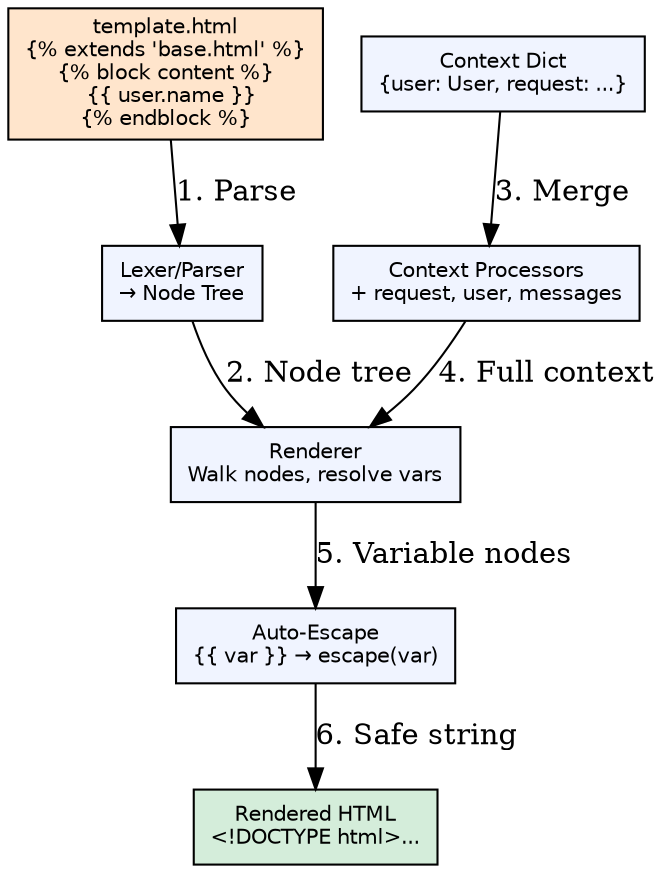
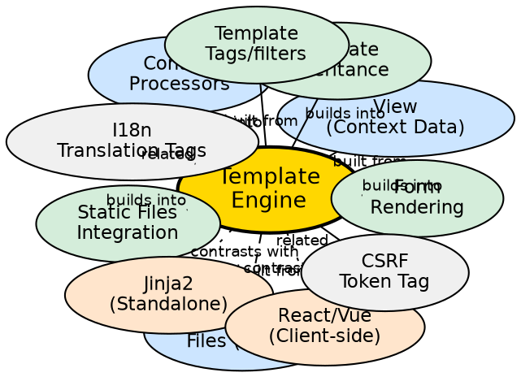

## Formal Definition

The Django Template Engine is a text-based templating system that separates presentation logic from business logic using a syntax of variables (`{{ variable }}`), tags (``), and filters (`{{ value|filter }}`), with support for template inheritance, inclusion, and automatic HTML escaping for security.

## Explanation

The template engine solves the problem of generating dynamic HTML (or any text format) without embedding business logic in presentation code. Templates contain only display logic — loops, conditionals, variable interpolation — while views prepare context data. The engine compiles templates to an intermediate representation, then renders them with a context dictionary, auto-escaping variables to prevent XSS unless explicitly marked safe.

## How It Works

1. **Template loaded** — `get_template('name.html')` or `render()` loads template from `TEMPLATES` dirs
2. **Template parsed** — Lexer tokenizes into `TextNode`, `VariableNode`, `BlockNode`, `IfNode`, `ForNode`
3. **Context created** — View builds context dict; context processors add global variables (`request`, `user`, `messages`)
4. **Template rendered** — `template.render(context)` walks node tree, resolves variables, executes tags
5. **Auto-escaping applied** — All `{{ variable }}` output passed through `escape()` unless `|safe` or `mark_safe()`
6. **Result returned** — Rendered string wrapped in `HttpResponse`

## Visual Explanation

## Semantic Network

## Key Properties

- **Auto-escaping by default**: `{{ user_input }}` safe from XSS; opt-out with `|safe` or `mark_safe()`
- **Template inheritance**: `` + `` enables layout reuse
- **Custom tags/filters**: `@register.simple_tag`, `@register.filter` extend template language
- **Loader flexibility**: `TEMPLATES['loaders']` supports filesystem, app directories, cached loader
- **Debug integration**: `TEMPLATE_DEBUG` shows template source lines in error pages

## Connections

- Built from: [[function-based-views|Function-Based Views]] — Primary consumer via `render()`
- Built from: [[class-based-views|Class-Based Views]] — `TemplateView`, `DetailView` use templates
- Built from: [[context-processors|Context Processors]] — Inject global template variables
- Builds into: [[template-inheritance|Template Inheritance]] — Layout composition pattern
- Builds into: [[static-files|Static Files Integration]] — ``
- Builds into: [[form-rendering|Form Rendering]] — `{{ form.as_p }}`, `{{ field }}`
- Contrasts with: [[jinja2|Jinja2]] — Faster, more Pythonic, standalone, similar syntax
- Contrasts with: [[client-side-templates|Client-Side Templates]] — SPA frameworks (React/Vue) render in browser
- Related: [[csrf-protection|CSRF Protection]] — `` tag
- Related: [[i18n|Internationalization]] — ``, `` tags

## Edge Cases & Gotchas

- **Variable lookup order**: Dict key → attribute → list index → callable (no args) → empty string
- **Silent failures**: Missing variables render as empty string (configurable via `string_if_invalid`)
- **`|safe` danger**: Marking user-controlled data as safe enables XSS; only use on trusted content
- **Performance**: Uncached template loading hits filesystem on every request; use `cached.Loader` in production

## Sources

- [[django-summary|Django Learning Roadmap]]