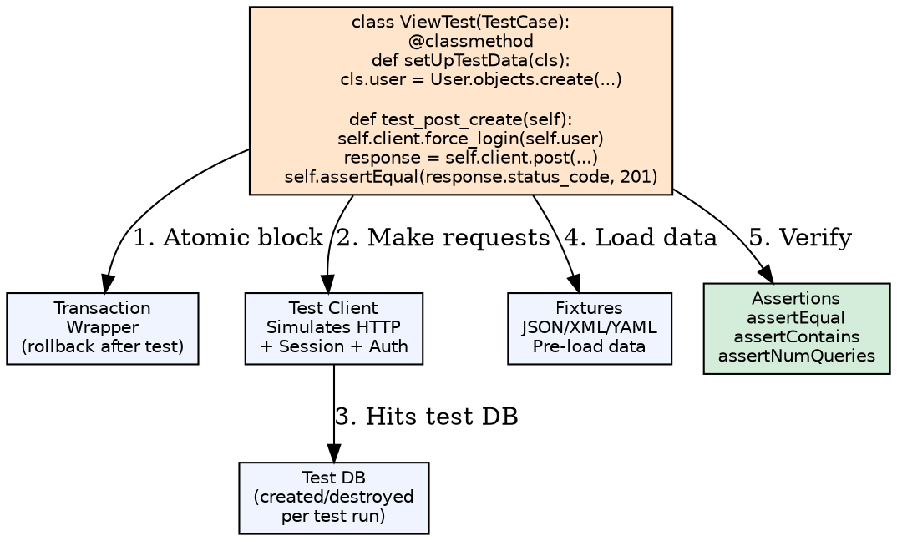
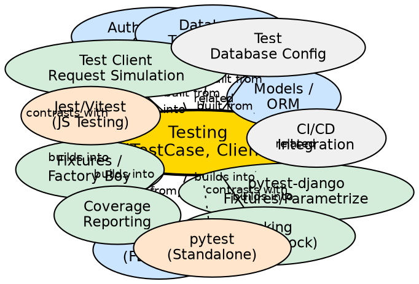

## Formal Definition

Django's testing framework (built on Python's `unittest`) provides a `TestCase` class with database transaction isolation, a `Client` for simulating requests, fixture loading, and assertion helpers, while `pytest-django` adds fixtures, parametrization, and plugin ecosystem for more expressive and maintainable test suites.

## Explanation

Testing solves the problem of verifying application behavior automatically and preventing regressions. Django's `TestCase` wraps each test in a transaction that rolls back after completion, ensuring database isolation without manual cleanup. The `Client` simulates HTTP requests (GET, POST, PUT, DELETE) with session and authentication support, allowing end-to-end view testing. `pytest-django` enhances this with dependency injection via fixtures, `parametrize` for data-driven tests, and parallel execution.

## How It Works

1. **TestCase subclass** — `class MyTest(TestCase):` — each test method runs in atomic transaction
2. **setUpTestData** — Class method runs once per class; creates objects in DB before all tests
3. **setUp** — Instance method runs before each test; for per-test state
4. **Client requests** — `self.client.get('/url/')`, `self.client.post('/url/', data, format='json')`
5. **Authentication** — `self.client.force_login(user)` or `self.client.credentials(HTTP_AUTHORIZATION=...)`
6. **Assertions** — `assertEqual`, `assertContains`, `assertRedirects`, `assertTemplateUsed`, `assertNumQueries`
7. **Fixtures** — `fixtures = ['initial_data.json']` loads JSON/XML/YAML before tests

## Visual Explanation

## Semantic Network

## Key Properties

- **Transaction isolation**: `TestCase` rolls back after each test; `TransactionTestCase` doesn't (for testing transactions)
- **Test Client**: `client.get()`, `post()`, `put()`, `patch()`, `delete()`, `head()`, `options()`, `trace()`
- **Authentication helpers**: `force_login(user)`, `logout()`, `credentials(**headers)`
- **Database assertions**: `assertNumQueries(n)` catches N+1; `assertQuerysetEqual(qs, values)`
- **Fixtures**: `loaddata`/`dumpdata`; `factory_boy` for programmatic test data (preferred over JSON fixtures)
- **pytest-django**: `pytest.mark.django_db` enables DB access; `client`, `admin_client`, `user` fixtures built-in

## Connections

- Built from: [[models-orm|Models/ORM]] — Test data creation and assertions
- Built from: [[function-based-views|Function-Based Views]] — Test view behavior
- Built from: [[class-based-views|Class-Based Views]] — Test CBV methods
- Built from: [[authentication-system|Authentication System]] — Test auth flows
- Built from: [[database-transactions|Database Transactions]] — TestCase isolation mechanism
- Builds into: [[test-client|Test Client]] — Request simulation API
- Builds into: [[fixtures-factory-boy|Fixtures/Factory Boy]] — Test data generation
- Builds into: [[pytest-django|pytest-django]] — Modern test runner with fixtures
- Builds into: [[coverage-reporting|Coverage Reporting]] — Code coverage metrics
- Builds into: [[mocking|Mocking]] — Isolate units from dependencies
- Contrasts with: [[pytest-standalone|pytest Standalone]] — Django-specific extensions vs pure pytest
- Related: [[ci-cd-integration|CI/CD Integration]] — Automated test runs on push
- Related: [[test-database-config|Test Database Config]] — `DATABASES['TEST']` settings

## Edge Cases & Gotchas

- **TestCase vs TransactionTestCase**: `TestCase` faster (rollback); use `TransactionTestCase` only when testing transaction behavior
- **`setUpTestData` caveats**: Objects created here persist across tests in class; don't modify them in tests
- **`assertNumQueries`**: Counts all queries including middleware; use `with self.assertNumQueries(2):` context manager
- **Migrations in tests**: `migrate` runs automatically; `--nomigrations` speeds up but may miss migration bugs
- **Static/media in tests**: `MEDIA_ROOT` should use temp dir; `STATICFILES_STORAGE` = `StaticFilesStorage` (no manifest)