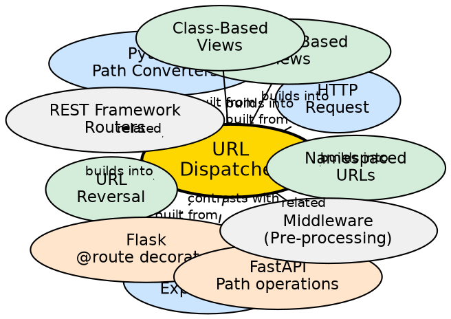

## Formal Definition

The URL Dispatcher is Django's routing mechanism that maps incoming HTTP request paths to view functions or class-based views using a declarative URL configuration (URLconf) composed of `path()` and `re_path()` patterns with optional converters, namespaces, and included sub-URLconfs.

## Explanation

The URL dispatcher solves the problem of connecting human-readable URLs to application logic. Instead of hardcoding URL-to-view mappings in a single file, Django uses a modular, hierarchical system where each app defines its own URL patterns, which are then included in the project's root URLconf. This enables namespacing, reversal, and maintainable routing at scale.

## How It Works

1. **Request received** — HTTP request path extracted from WSGI/ASGI environ
2. **Root URLconf loaded** — `ROOT_URLCONF` setting points to project's `urls.py`
3. **Pattern matching** — Iterator through `urlpatterns` list in order; first match wins
4. **Converter extraction** — Path converters (`int`, `str`, `slug`, `uuid`, `path`) parse and type-cast URL segments
5. **View resolution** — Matched view callable receives `request` + extracted kwargs
6. **Namespace resolution** — `include()` with `namespace` enables reversible named URLs across apps

## Visual Explanation

```dot
digraph url_dispatcher {
  rankdir=LR;
  node [shape=box style=filled fillcolor="#f0f4ff" fontname="Helvetica" fontsize=10];

  Request [label="HTTP Request\nGET /blog/42/" fillcolor="#ffe5cc"];
  RootURLconf [label="Root URLconf\nurls.py"];
  IncludeBlog [label="include('blog.urls')\nnamespace='blog'"];
  BlogURLconf [label="Blog URLconf\nblog/urls.py"];
  PathPattern [label="path('post/<int:pk>/',\n     views.detail,\n     name='detail')"];
  View [label="View Function\npost_detail(request, pk=42)" fillcolor="#d4edda"];

  Request -> RootURLconf [label="1. Match prefix"];
  RootURLconf -> IncludeBlog [label="2. Delegate to blog/"];
  IncludeBlog -> BlogURLconf [label="3. Strip prefix"];
  BlogURLconf -> PathPattern [label="4. Match pattern"];
  PathPattern -> View [label="5. Extract pk=42\n   Call view"];
}
```

## Semantic Network

## Key Properties

- **Order matters**: Patterns evaluated top-to-bottom; first match wins
- **Converters**: Built-in (`int`, `str`, `slug`, `uuid`, `path`) + custom converters via `register_converter()`
- **Reversal**: `reverse('name', args=[...])` and `` generate URLs from names
- **Namespaces**: `app_name` + `include(namespace=...)` prevent name collisions across apps
- **Lazy evaluation**: `include()` accepts string to avoid circular imports

## Connections

- Built from: [[django-web-framework|Django Web Framework]] — Core routing component
- Built from: [[http-protocol|HTTP Protocol]] — Routes HTTP request paths
- Builds into: [[function-based-views|Function-Based Views]] — Targets for URL patterns
- Builds into: [[class-based-views|Class-Based Views]] — `as_view()` as URL target
- Builds into: [[url-reversal|URL Reversal]] — Named patterns enable reversal
- Contrasts with: [[flask-routing|Flask @route]] — Decorator-based, single-file routing
- Contrasts with: [[fastapi-routing|FastAPI Path Operations]] — Type-annotated, automatic OpenAPI
- Related: [[django-rest-framework-routers|DRF Routers]] — Auto-generates URL patterns for ViewSets

## Edge Cases & Gotchas

- **Trailing slashes**: `APPEND_SLASH` redirects but can cause POST data loss; be consistent
- **Catch-all patterns**: `path('<path:resource>/', ...)` at end prevents 404s but hides bugs
- **Namespace collisions**: Missing `app_name` in included URLconf breaks reversal
- **Converter precedence**: More specific patterns must come before general ones (`<int:pk>` before `<str:slug>`)