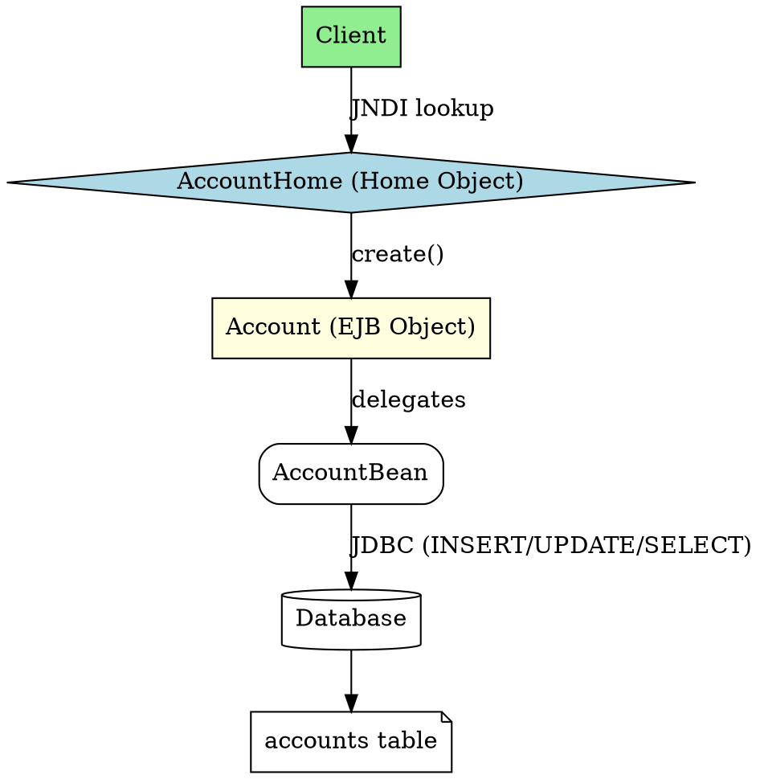

## The Problem
Students need a concrete BMP (Bean-Managed Persistence) example that shows all pieces: remote interface, home interface, primary key class, bean class with JDBC code, deployment descriptor, and client code—without the fluff.

## Core Idea
The Account Bean is a BMP entity bean representing a bank account. It demonstrates: `Account` remote interface, `AccountHome` home interface with finder methods, `AccountPK` primary key class, `AccountBean` with JDBC code for CRUD, `ejb-jar.xml` with `<persistence-type>Bean</persistence-type>`, and client code using JNDI lookups.

## How It Works

### 1. Remote Interface (`Account.java`)
```java
import javax.ejb.EJBObject;
import java.rmi.RemoteException;

public interface Account extends EJBObject {
    public void deposit(double amt) throws RemoteException;
    public void withdraw(double amt) throws RemoteException, AccountException;
    public double getBalance() throws RemoteException;
}
```

### 2. Home Interface (`AccountHome.java`)
```java
public interface AccountHome extends EJBHome {
    public Account create(String accountID, String ownerName) 
        throws RemoteException, CreateException;
    public Account findByPrimaryKey(AccountPK key) 
        throws RemoteException, FinderException;
    public double getTotalBankValue() 
        throws RemoteException, AccountException; // Home method
}
```

### 3. Primary Key Class (`AccountPK.java`)
```java
public class AccountPK implements Serializable {
    public String accountID;
    public AccountPK() {}
    public AccountPK(String id) { this.accountID = id; }
}
```

### 4. Deployment Descriptor (`ejb-jar.xml`)
Key elements: `<persistence-type>Bean</persistence-type>`, `<prim-key-class>examples.bmp.AccountPK</prim-key-class>`, `<resource-ref>` for JDBC.

### 5. Client Code
Looks up Home via JNDI, calls `home.create()`, `account.deposit(100)`, `home.findByPrimaryKey(pk)`.

## Visual Explanation


## Key Properties

- **BMP**: Bean writes all JDBC code (ejbCreate → INSERT, ejbLoad → SELECT, etc.)
- **AccountPK**: Wrapper for primary key (String accountID)
- **Home methods**: `getTotalBankValue()` runs from pool, not specific instance
- **Resource reference**: `<resource-ref>` configures JDBC DataSource in JNDI
- **CMT**: Deployment descriptor sets `<transaction-type>Container</transaction-type>`

## Connections
- Built from: [[bean-managed-persistence|Bean-Managed Persistence]] — this is a BMP example
- Built from: [[primary-key-class|Primary Key Class]] — AccountPK is the PK class
- Built from: [[home-interface|Home Interface]] — AccountHome with finder methods
- Built from: [[remote-interface|Remote Interface]] — Account interface
- Built from: [[jdbc|JDBC]] — BMP uses JDBC for all DB operations
- Builds into: [[ejb-deployment-descriptor|EJB Deployment Descriptor]] — XML config shown
- Related: [[finder-methods|Finder Methods]] — `findByPrimaryKey()` is a finder
- Related: [[account-exception|AccountException]] — custom application exception

## Edge Cases & Gotchas
- **SQL exceptions**: Must handle `SQLException` in BMP JDBC code
- **Withdraw validation**: Check balance before withdrawing (throw `AccountException`)
- **Home methods**: Run on pooled bean, not associated with specific EJB object
- **Resource reference**: Must configure `jdbc/bmp-account` in container-specific descriptor
- **12-mark question**: Focus on interfaces, PK class, XML—not full JDBC code