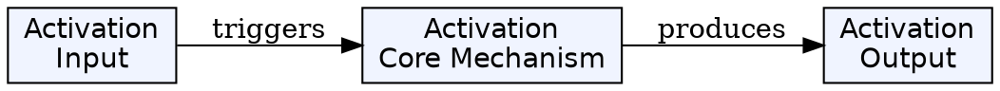
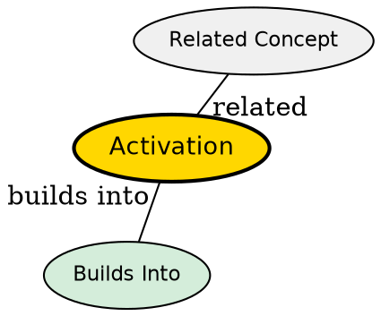

## The Problem

How does a passivated stateful session bean resume service when a client makes a request?

## Core Idea

Activation is the process where the container deserializes a previously passivated stateful session bean back into memory to handle a client request. The bean moves from "Passive" state to "Ready" state.

## How It Works

- Container reads serialized state from storage
- Container creates a new instance or reuses an existing one
- Container invokes ejbActivate() callback on the bean
- Bean re-acquires resources it released during passivation
- Business method executes on the restored bean

## Key Properties

- Only applies to stateful session beans
- Triggered when client calls a method on a passivated bean
- Restores conversational state from storage
- Opposite of passivation

## Visual Explanation

## Semantic Network

## Connections

- Built from: [[passivation|Passivation]] -- activation is the reverse of passivation
- Builds into: [[stateful-session-bean|Stateful Session Bean]] -- stateful beans go through this cycle during their lifecycle
- Related: [[ejb-container|EJB Container]] -- the container performs activation
- Related: [[instance-pooling|Instance Pooling]] -- container manages activated beans in pools

## Edge Cases & Gotchas

- Activation is slower than direct method calls on active beans
- External resources may need to be re-acquired (e.g., database connections)
- State serialization must be serializable (implement Serializable)