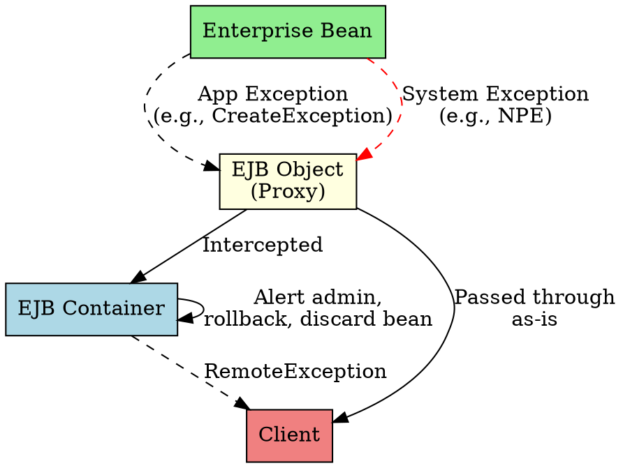

# Application vs System Exceptions

## The Problem
When something goes wrong in your EJB, how should the container handle it? Should it tell the client? Should it rollback the transaction? Should it alert the administrator? Different errors need different treatments.

## Core Idea
EJB defines two exception types with different handling strategies:

- **Application Exceptions**: Routine business problems (bad input, insufficient funds). Always thrown back to the client—the client needs to know and handle these.
- **System Exceptions**: Critical failures (database down, `NullPointerException`). Container intercepts these, may alert admin, and usually discards the bean (it's in an undefined state).

## How It Works

| Aspect | Application Exception | System Exception |
|--------|----------------------|------------------|
| **Examples** | `CreateException`, `InsufficientFundsException` | `NullPointerException`, DB connection failure |
| **Thrown to client?** | Always | May be wrapped as `RemoteException` |
| **Transaction** | Client decides rollback | Container may auto-rollback |
| **Bean state** | Bean remains usable | Bean is discarded (undefined state) |
| **Defined in** | `javax.ejb` package or custom | `java.lang.RuntimeException` or `RemoteException` |

## Visual Explanation

## Key Properties
- **EJB Object intercepts exceptions**: It decides what to do before reaching client
- **Application exceptions are part of business logic**: They carry valuable data for the client
- **System exceptions leave bean in undefined state**: Container stops using that bean instance
- **Two rules of thumb**:
  1. Application exceptions → always thrown to client
  2. System exceptions → container can do anything (alert, discard, throw)

## Connections
- **Built from:** [[ejb-object|EJB Object]] (intercepts exceptions)
- **Builds into:** [[transactions|Transactions]] (exceptions affect transaction outcome)
- **Related:** [[ejb-container|EJB Container]] (handles system exceptions)
- **Contrasts with:** Regular Java (all exceptions handled the same way)

## Edge Cases & Gotchas
- **Unchecked exceptions are system exceptions**: `RuntimeException` subclasses are treated as system exceptions
- **Don't rely on `ejbRemove()` for cleanup**: If a system exception occurs, `ejbRemove()` may never be called
- **Transparent failover**: Some containers redirect to another bean for stateless beans after system exceptions

## Sources
- [[ejb5-summary|EJB5 Source Summary]]
