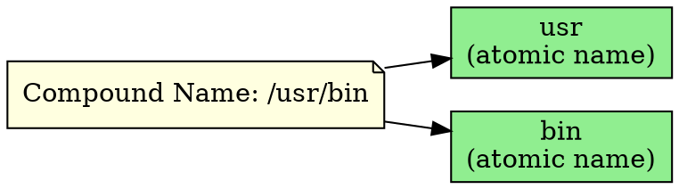

## The Problem
In a hierarchical naming system like JNDI, we need a way to refer to individual name components. How do we represent the smallest, indivisible unit of a name that cannot be further subdivided?

## Core Idea
An atomic name is a simple, basic, indivisible name in JNDI. Examples include `etc`, `fstab`, `usr`, `bin` — each is a single component that cannot be split further. They are the building blocks of compound names.

## How It Works
1. Atomic names are the leaf components in a compound name
2. In `/etc/fstab`, the atomic names are `etc` and `fstab`
3. In JNDI, each binding in a context has a distinct atomic name
4. Atomic names are combined with a syntax (like `/`) to form compound names
5. They serve as keys in the binding table of a context

## Visual Explanation

## Key Properties
- **Indivisible**: Cannot be split into smaller naming components
- **Syntax-independent**: The atomic name itself doesn't include separators
- **Unique within context**: Each atomic name in a context maps to one binding
- **Case-sensitive**: Typically, atomic names are case-sensitive
- **Building block**: Combined to form compound names

## Connections
- Built from: [[jndi-naming-concepts|JNDI Naming Concepts]] — atomic names are part of JNDI naming
- Builds into: [[compound-name|Compound Name]] — atomic names combine to form compound names
- Related: [[jndi-context|JNDI Context]] — contexts contain bindings with atomic names
- Related: [[jndi-binding|JNDI Binding]] — each binding has an atomic name as its key

## Edge Cases & Gotchas
- **Special characters**: Some characters may have special meaning in compound name syntax
- **Length limits**: Providers may impose limits on atomic name length
- **Reserved words**: Some names may be reserved by the provider

## Sources
- [[ejb6-summary|EJB6 Source Summary]]
