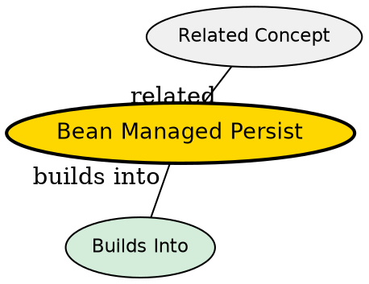

## The Problem

How do you have full control over how entity beans interact with the database?

## Core Idea

With bean-managed persistence (BMP), the developer writes explicit JDBC code (or uses other database APIs) in the entity bean to handle all database operations. The developer is responsible for implementing ejbCreate(), ejbRemove(), ejbFind(), and other data access methods.

## How It Works

- Developer writes JDBC code in bean methods
- ejbCreate() inserts data into the database
- ejbRemove() deletes data from the database
- Finder methods (ejbFindByPrimaryKey, etc.) query the database
- Container calls these methods, but developer implements the SQL logic

## Key Properties

- Full control over database operations
- Developer writes JDBC code
- More flexibility than CMP
- More code to maintain
- Container still provides middleware services

## Visual Explanation

## Semantic Network

## Connections

- Built from: [[entity-bean|Entity Bean]], [[jdbc|JDBC]]
- Builds into: [[ejbcreate|ejbCreate()]], [[ejbremove|ejbRemove()]], [[finder-methods|Finder Methods]], [[ejbload|ejbLoad()]], [[ejbstore|ejbStore()]], [[one-to-one-relationship|One-to-One Relationship]], [[one-to-many-relationship|One-to-Many Relationship]], [[many-to-many-relationship|Many-to-Many Relationship]]
- Contrasts with: [[container-managed-persistence|Container-Managed Persistence]]
- Related: [[getprimarykey|getPrimaryKey()]], [[instance-pooling|Instance Pooling]], [[primary-key-class|Primary Key Class]], [[session-bean-relationships|Session Bean Relationships]]

## Edge Cases & Gotchas

- More error-prone than CMP
- Database-specific code may reduce portability
- Must handle transactions manually in some cases