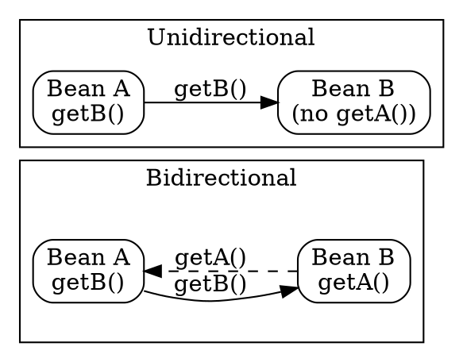

## The Problem
When two entity beans have a relationship, you need to decide which bean can navigate to the other. If only one side has a reference, the other side can't "look back." Without clear directionality, you might write code that can't navigate relationships the way business logic requires.

## Core Idea
**Bidirectional:** Both entities can navigate to each other (A→B and B→A). **Unidirectional:** Only one entity can navigate to the other (A→B, but B doesn't know about A). Directionality applies to all cardinalities (1:1, 1:N, M:N).

## How It Works

### Bidirectional (Two-Way)
```java
// OrderBean
private Shipment shipment;
public Shipment getShipment() { return shipment; }

// ShipmentBean
private Order order;
public Order getOrder() { return order; }
```
Both beans have get/set methods for each other. CMP: both sides have `<cmr-field>` in deployment descriptor.

### Unidirectional (One-Way)
```java
// OrderBean
private Shipment shipment;
public Shipment getShipment() { return shipment; }

// ShipmentBean
// NO Order field, NO getOrder() method
```
Only Order knows about Shipment. Shipment cannot navigate to Order.

### CMP Deployment Descriptor
- **Bidirectional:** Two `<cmr-field>` entries (one in each bean's relationship role)
- **Unidirectional:** One `<cmr-field>` entry (only on the navigating side)

## Visual Explanation


## Key Properties
- **Bidirectional:** Full navigation both ways; more flexible but uses more memory (both sides hold references)
- **Unidirectional:** One-way only; less memory, simpler, but limits navigation
- Directionality is independent of cardinality (can be 1:1, 1:N, or M:N with any directionality)
- In CMP, directionality is set via `<cmr-field>` presence in deployment descriptor
- EJB directionality may not match database schema directionality (object model ≠ database model)

## Connections
- Built from: [[one-to-one-relationship|One-to-One Relationship]] — directionality applies to 1:1
- Built from: [[one-to-many-relationship|One-to-Many Relationship]] — directionality applies to 1:N
- Built from: [[many-to-many-relationship|Many-to-Many Relationship]] — directionality applies to M:N
- Related: [[session-bean-relationships|Session Bean Relationships]] — session beans can also implement relationships but manually
- Related: [[normalized-vs-denormalized-schema|Normalized vs Denormalized Schema]] — directionality vs database mapping

## Edge Cases & Gotchas
- Omitting a `<cmr-field>` makes the relationship unidirectional on that side
- Unidirectional limits queries — can't do "find all orders for this shipment" if Shipment doesn't know about Order
- CMP container doesn't enforce directionality at compile time — misconfiguration found at deploy time
- Object directionality doesn't require matching database directionality (EJB abstracts this)

## Sources
- [[EJb4-summary|EJb4.md Source Summary]]
