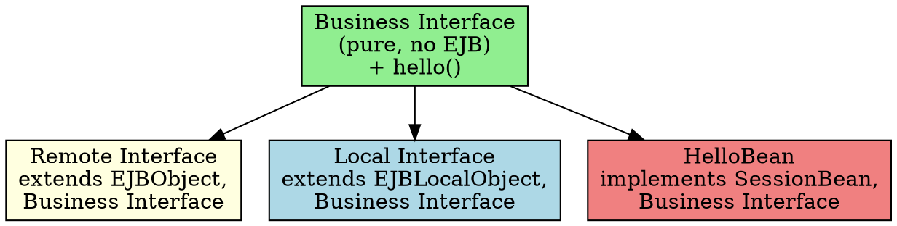

## The Problem
EJB component interfaces (Remote/Local) extend EJB-specific interfaces (`EJBObject`, `EJBLocalObject`) which have methods meant for clients, not beans. If beans don't implement the component interface (to avoid pollution), how do we get compile-time checking that the bean has all required business methods?

## Core Idea
Define a "pure" business interface containing only your business method signatures—no EJB dependencies. Have both the Remote/Local interface AND the bean class implement this business interface. This gives compile-time checking without polluting the bean with EJB client methods.

## How It Works

```java
// 1. Pure business interface (no EJB stuff)
public interface HelloBusinessMethods {
    String hello() throws RemoteException;
}

// 2. Remote interface extends BOTH EJBObject and business interface
public interface HelloRemote extends javax.ejb.EJBObject, HelloBusinessMethods {}

// 3. Local interface also extends business interface
public interface HelloLocal extends javax.ejb.EJBLocalObject, HelloBusinessMethods {}

// 4. Bean implements business interface (+ SessionBean)
public class HelloBean implements SessionBean, HelloBusinessMethods {
    public String hello() { return "Hello, World!"; }
}
```

## Visual Explanation



## Key Properties
- **Compile-time safety**: If bean misses a business method, compilation fails
- **No pollution**: Bean doesn't implement `EJBObject` methods
- **Shared contract**: Both bean and EJB object share the same business method signatures
- **One downside**: Local interface inherits `RemoteException` from business interface (if business interface declares it)

## Connections
- **Built from:** [[why-bean-doesnt-implement-interface|Why Bean Doesn't Implement Component Interface]]
- **Builds into:** [[remote-interface|Remote Interface]], [[local-home-interface|Local Home Interface]]
- **Related:** [[session-bean|Session Bean]], [[entity-bean|Entity Bean]]
- **Contrasts with:** Direct implementation (bean implements remote interface directly)

## Edge Cases & Gotchas
- **`RemoteException` leakage**: Business interface meant for both remote and local still declares `RemoteException`—local clients don't need it
- **EJB 3.x+ solves this**: Uses `@Local` and `@Remote` annotations—no need for this pattern
- **Not mandatory**: Most developers just let the container verify at deployment time (not compile time)