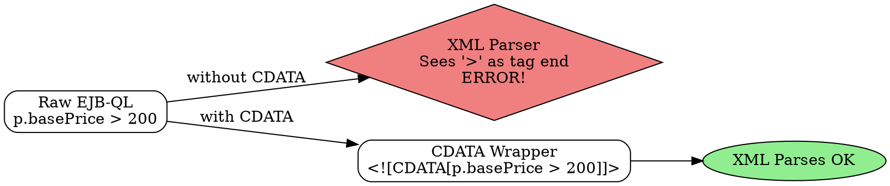

## The Problem
When writing EJB-QL queries inside `ejb-jar.xml`, comparison operators like `<` and `>` conflict with XML's own tag delimiters. The XML parser will try to interpret `basePrice > 200` as XML tags, causing parse errors and deployment failure.

## Core Idea
The CDATA (Character Data) section tells the XML parser to treat everything inside as raw text, not XML markup. It is a way to "escape" special characters without escaping each one individually.

## How It Works
1. XML normally interprets `<` as the start of a tag and `>` as the end of a tag
2. Wrapping content in `<![CDATA[ ... ]]>` disables XML parsing for that section
3. In EJB-QL: `SELECT OBJECT(p) FROM PRODUCTS p WHERE p.basePrice <![CDATA[>]]> 200`
4. The parser reads the comparison operator as literal text, not markup
5. This is a generic XML technique, not specific to EJB — used anywhere XML contains code or special characters

## Visual Explanation

## Key Properties
- Syntax: `<![CDATA[ content ]]>` — brackets and parentheses are mandatory
- Content inside is treated as raw character data
- Only solution for using `>`, `<`, `>=`, `<=` inside XML element text
- Not needed in Java code or non-XML contexts

## Connections
- Built from: [[ejb-deployment-descriptor|EJB Deployment Descriptor]] — CDATA is used inside XML deployment descriptors
- Builds into: [[ejb-ql|EJB-QL]] — EJB-QL queries in XML need CDATA for operators
- Related: [[container-managed-persistence|CMP]] — CMP uses EJB-QL in deployment descriptors
- Related: [[xml-basics|XML Basics]] — general XML escaping concept

## Edge Cases & Gotchas
- `]]>` cannot appear inside a CDATA section (it would end the CDATA prematurely)
- CDATA is not the same as XML entity escaping (`&lt;` and `&gt;`) — both work but CDATA is cleaner for large code blocks
- Forgetting CDATA causes cryptic XML parse errors during EJB deployment