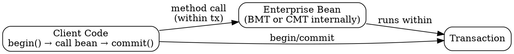

## The Problem
When a remote client calls an enterprise bean that manages its own transactions, and the network/ server crashes before the result is returned, the client gets a `RemoteException` but doesn't know if the transaction succeeded or failed. The client needs to control the transaction to know the outcome.

## Core Idea
In client-initiated transactions, the client code (servlet, JSP, other EJB, CORBA client) begins and ends the transaction — not the bean. The bean still uses programmatic or declarative transactions internally, but the outer transaction scope is controlled by the client.

## How It Works
1. Client code looks up transaction service (via JTA — Java Transaction API)
2. Client calls `begin()` to start the transaction
3. Client calls the enterprise bean's business method (bean runs within client's transaction)
4. Bean uses either BMT or CMT internally (client's transaction propagates to bean)
5. Client calls `commit()` or `abort()` to end the transaction
6. If network crashes, client knows the transaction outcome (since it controls it)

## Visual Explanation

## Key Properties
- Client knows transaction outcome (unlike when bean manages its own tx)
- Bean still needs BMT or CMT internally — client-initiated is the outer demarcation
- Higher rollback rates in distributed systems (network failures cause rollbacks)
- Use sparingly, especially for remote clients over WAN
- Client code can be: servlet, JSP, other EJB, CORBA client, application

## Connections
- Built from: [[transaction-demarcation|Transaction Demarcation]] — the third demarcation style
- Built from: [[transactions|Transactions]] — client controls transaction boundaries
- Related: [[declarative-vs-programmatic-transactions|CMT vs BMT]] — bean still uses one of these internally
- Contrasts with: [[message-driven-bean|MDB]] — MDB is asynchronous; client-initiated is synchronous
- Related: [[entity-bean-transactions|Entity Bean Transactions]] — entity beans must use CMT even when client initiates tx

## Edge Cases & Gotchas
- Distributed applications have more rollbacks due to network failures
- Client must have access to JTA (Java Transaction API) to begin/commit
- If the bean also uses BMT internally, there are nested transaction scopes (but not true nested tx per EJB spec)
- Not recommended for remote clients over unreliable networks (high rollback rate)