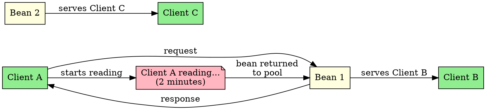

## The Problem
When analyzing server capacity, we might assume each client needs a dedicated bean instance. But users don't click buttons continuously—they read pages, think, and then act. How can we leverage this idle time to serve more clients with fewer resources?

## Core Idea
Client think time is the period when a user is viewing a page or thinking between actions. During this time, the server-side bean instance can be reassigned to serve other clients, dramatically improving resource utilization.

## How It Works
1. **User clicks button**: Server assigns bean, executes method, returns response
2. **User reads page**: Server returns bean to pool (5-10 minutes of idle time)
3. **Pool reuse**: Same bean serves other clients during this idle period
4. **Result**: 50-100 beans can serve 10,000 clients

This is the key insight that makes instance pooling viable for human-facing applications.

## Visual Explanation

## Key Properties
- **Human behavior**: Users spend most time reading, not clicking
- **Resource multiplier**: 50 beans can serve 10,000 clients
- **Key to pooling**: Makes stateless session bean pooling effective
- **Not applicable**: Automated clients (APIs) may not have think time
- **Exam keyword**: Mention in instance pooling answers

## Connections
- Built from: [[instance-pooling|Instance Pooling]] — think time enables pooling efficiency
- Related: [[stateless-session-bean|Stateless Session Bean]] — primary beneficiary
- Related: [[session-bean-lifetime|Session Bean Lifetime]] — beans returned to pool during think time
- Builds into: [[scalability|Scalability]] — think time improves scalability

## Edge Cases & Gotchas
- **API clients**: May not have think time (continuous requests)
- **Timeout**: Session may timeout during long think time
- **Stateful beans**: Have dedicated state, can't leverage think time for pooling