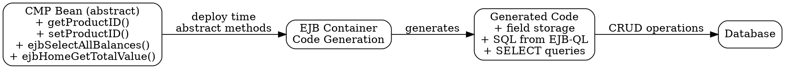

# CMP Abstract Accessors and Methods

## The Problem
In Container-Managed Persistence, the developer doesn't write the actual persistence code — the container generates it. But the developer still needs to define what data the bean has and how to query it. Without abstract method declarations, there's no way for the container to know what fields and queries to generate code for.

## Core Idea
CMP entity beans use abstract getter/setter pairs for persistent fields (no instance variables), abstract `ejbSelect` methods for internal queries, and `ejbHome` methods for class-level business logic. The container implements all of these at deployment time.

## How It Works
1. **Abstract Persistent Fields:** Define `public abstract String getProductID()` and `public abstract void setProductID(String id)` — no backing instance variable, container generates the storage
2. **Abstract ejbSelect Methods:** Define `public abstract Collection ejbSelectAllAccountBalances() throws FinderException` — internal helper queries declared in the bean, implemented by container using EJB-QL in the deployment descriptor
3. **Home Business Methods:** Define `public double ejbHomeGetTotalBankValue()` — methods prefixed with `ejbHome` that operate at the class level (not instance level), called via the Home interface
4. The container reads these abstract declarations and generates the actual implementation code during deployment

## Visual Explanation

## Key Properties
- No instance variables declared — container manages the actual data storage
- Abstract methods must be public (container needs to implement them)
- `ejbSelect` methods are called internally by the bean, not by clients
- Home methods are called via the Home interface, not the Remote interface
- All abstract methods map to EJB-QL queries in `ejb-jar.xml`

## Connections
- Built from: [[container-managed-persistence|CMP]] — abstract accessors are a CMP-only concept
- Builds into: [[ejb-ql|EJB-QL]] — each abstract method maps to an EJB-QL query
- Related: [[ejbcreate|ejbCreate()]] — CMP ejbCreate only calls setters, returns null
- Related: [[ejbhome|ejbHome()]] — home methods are a specific type of class-level method
- Contrasts with: [[bean-managed-persistence|BMP]] — BMP uses concrete fields and raw JDBC instead

## Edge Cases & Gotchas
- CMP ejbCreate() must return `null` (not `this` like BMP) — the container creates the actual primary key
- Forgetting to define the EJB-QL query for an ejbSelect method causes deployment error
- Abstract methods cannot have method bodies — must be purely declared
- Home methods cannot access instance fields (they operate at class level, not on a specific bean)

## Sources
- [[EJb4-summary|EJb4.md Source Summary]]
