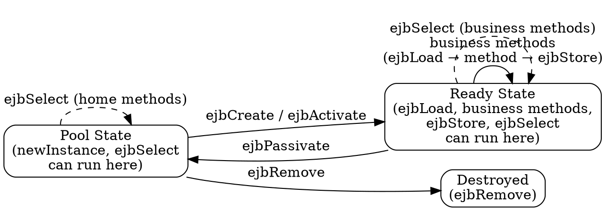

## The Problem
Entity beans (both BMP and CMP) need a well-defined lifecycle that the container manages — from creation, to ready state, to passivation, and eventual removal. If the lifecycle isn't clearly defined, the container wouldn't know when to call `ejbLoad()`, `ejbStore()`, or when to create/remove bean instances.

## Core Idea
The CMP entity bean lifecycle is identical to the BMP lifecycle (Figure 8.4 matches Figure 7.3). The only addition is the `ejbSelect()` method which can run in both Pooled and Ready states. All callback methods (`ejbLoad`, `ejbStore`, `ejbCreate`, etc.) are empty in CMP because the container handles everything.

## How It Works
1. Container instantiates bean via `newInstance()` → enters Pool state
2. Client calls `create()` or `find()` → container calls `ejbCreate()` / `ejbActivate()` → enters Ready state
3. In Ready state: `ejbLoad()` (container loads data), business methods run, `ejbStore()` (container saves data)
4. Bean can return to Pool via `ejbPassivate()` (released back to pool)
5. From Pool: `ejbRemove()` → bean destroyed, or `ejbSelect()` can run in Pool state (for home methods)
6. The key difference from BMP: all callbacks are empty — container does the actual database work automatically

## Visual Explanation

## Key Properties
- Identical to BMP lifecycle — no structural differences
- `ejbSelect()` is the only method that can run in Pool state (for home methods)
- All lifecycle callbacks are empty in CMP — container handles persistence automatically
- Container manages when to call `ejbLoad()` and `ejbStore()` based on transaction boundaries
- Passivation only applies to stateful session beans, not entity beans (entity beans stay in Ready or Pool)

## Connections
- Built from: [[entity-bean|Entity Bean]] — lifecycle applies to all entity beans
- Built from: [[ejb-lifecycle-stateful|Stateful Lifecycle]] — similar pool/ready concept but for session beans
- Contrasts with: [[ejb-lifecycle-stateless|Stateless Lifecycle]] — stateless has no passivation, only method-ready pool
- Related: [[cmp-abstract-accessors|CMP Abstract Accessors]] — callbacks are empty because container uses abstract methods
- Related: [[instance-pooling|Instance Pooling]] — pooled state is where beans wait for work

## Edge Cases & Gotchas
- Despite the lifecycle diagram showing `ejbCreate` in the flow, CMP's `ejbCreate` is empty — container does the INSERT
- `ejbSelect()` running in Pool state is a subtle detail often missed in exams
- Entity beans don't passivate like stateful session beans — they go to Pool, not Passive state
- The lifecycle is the same for CMP and BMP, but the implementation of callbacks differs completely

## Sources
- [[EJb4-summary|EJb4.md Source Summary]]
