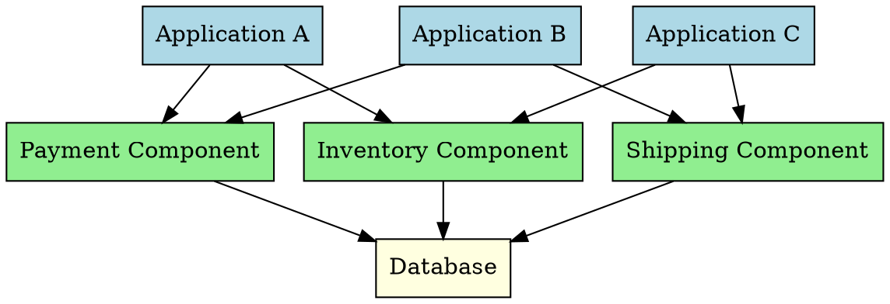

## The Problem
Monolithic applications mixed everything together—UI, business logic, and data access all in one codebase. This made code impossible to reuse across different applications and hard to maintain as the application grew.

## Core Idea
"Divide and Conquer" applied to software architecture. Break a large application into small, independent pieces (components/services), where each component handles a specific responsibility. These components can be reused across multiple applications.

## How It Works
1. **Decomposition**: Identify distinct responsibilities and split them into separate components
2. **Interface Definition**: Each component exposes a contract (interface) defining what it can do
3. **Independent Deployment**: Components can be developed, deployed, and updated independently
4. **Reusability**: Same component can serve multiple applications

In EJB, the component architecture manifests as:
- Enterprise Beans = business logic components
- Interfaces (Remote/Local) = contracts
- Container = runtime environment managing components

## Visual Explanation

## Key Properties
- Components are **independent** and **self-contained**
- Communication happens through **well-defined interfaces**
- Promotes **code reuse** across applications
- Enables **parallel development** by different teams
- **Scalability**: Scale individual components based on demand

## Connections
- **Built from:** [[session-bean|Session Bean]], [[entity-bean|Entity Bean]]
- **Builds into:** [[ejb-container|EJB Container]] (hosts components)
- **Contrasts with:** Monolithic architecture (all-in-one)
- **Related:** [[middleware|Middleware]] (infrastructure for component communication)

## Edge Cases & Gotchas
- Over-decomposition leads to **distributed monolith**—too many tiny components with complex dependencies
- Network overhead: Component calls cross process/JVM boundaries (unlike monolithic in-process calls)
- Versioning: Updating a component interface can break all dependent applications