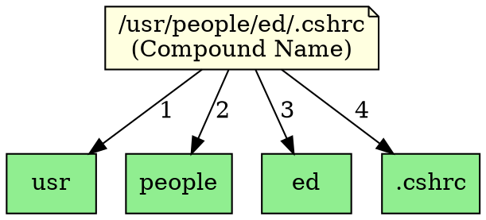

## The Problem
A single atomic name can only identify objects at one level of the hierarchy. How do we refer to objects deep in a tree structure, like `/usr/people/ed/.cshrc`? We need a way to combine multiple atomic names into a full path.

## Core Idea
A compound name is zero or more atomic names combined using a specific syntax (like `/` in file paths). It represents a full path through the naming hierarchy. Examples: `/etc/fstab`, `/usr/bin`, `java:comp/env/jdbc`.

## How It Works
1. Atomic names are concatenated with a separator (e.g., `/` for file-like, `.` for DNS-like)
2. `/usr/people/ed` has four atomic names: `usr`, `people`, `ed`
3. Each level is resolved sequentially: look up `usr`, then `people` within `usr`, then `ed` within `people`
4. In JNDI, compound names can span multiple naming systems (federation)
5. JNDI compound names may use different syntaxes depending on the provider

## Visual Explanation

## Key Properties
- **Hierarchical**: Represents a path through the naming tree
- **Syntax-dependent**: Uses provider-specific separator characters
- **Resolved sequentially**: Each component is looked up in the context of the previous component
- **Can span contexts**: May traverse multiple subcontexts
- **JNDI examples**: `java:comp/env/ejb/MyBean`, `jdbc/myDataSource`

## Connections
- Built from: [[atomic-name|Atomic Name]] — compound names are made of atomic names
- Builds into: [[jndi-binding|JNDI Binding]] — bindings use compound names for lookup
- Related: [[jndi-naming-concepts|JNDI Naming Concepts]] — compound names are a core concept
- Related: [[jndi-context|JNDI Context]] — contexts resolve compound names
- Related: [[subcontext|Subcontext]] — compound names traverse subcontexts

## Edge Cases & Gotchas
- **Syntax differences**: LDAP uses commas (`,`), file system uses slashes (`/`)
- **Escaping**: Special characters in atomic names may need escaping in compound names
- **Absolute vs relative**: Some compound names are relative to a context
- **Parsing errors**: Incorrect syntax causes `InvalidNameException`

## Sources
- [[ejb6-summary|EJB6 Source Summary]]
