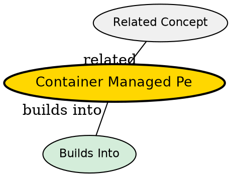

## The Problem

How do you avoid writing repetitive JDBC/database code for every entity bean?

## Core Idea

With container-managed persistence (CMP), the EJB container automatically handles all database operations. The developer writes no JDBC code--the container generates SQL statements for create, read, update, and delete operations.

## How It Works

- Developer strips entity bean of any persistence logic
- Developer uses vendor tools to define O/R mappings (how bean fields map to database columns)
- At deployment time, container generates the data access code
- Container automatically performs INSERT, UPDATE, DELETE, and SELECT operations
- Mapping can be done at deployment time, making beans storage-independent

## Key Properties

- Container handles all persistence automatically
- No JDBC code in the bean
- O/R mapping defined at deployment time
- Storage-independent--can switch databases without changing bean code
- Reduces bean size significantly

## Visual Explanation

## Semantic Network

## Connections

- Built from: [[entity-bean|Entity Bean]], [[ejb-container|EJB Container]]
- Builds into: [[ejbcreate|ejbCreate()]], [[ejbremove|ejbRemove()]], [[ejbload|ejbLoad()]], [[ejbstore|ejbStore()]], [[cmp-abstract-accessors|CMP Abstract Accessors]], [[cmp-lifecycle|CMP Lifecycle]]
- Contrasts with: [[bean-managed-persistence|Bean-Managed Persistence]]
- Related: [[object-relational-mapping|Object-Relational Mapping]], [[ejb-ql|EJB-QL]], [[cdata-hack|CDATA Hack]], [[one-to-one-relationship|One-to-One Relationship]], [[one-to-many-relationship|One-to-Many Relationship]], [[many-to-many-relationship|Many-to-Many Relationship]], [[bidirectional-vs-unidirectional|Bidirectional vs Unidirectional]]

## Edge Cases & Gotchas

- Less control over exact SQL generated
- Vendor-specific tools may be required for mapping
- May not support all database features