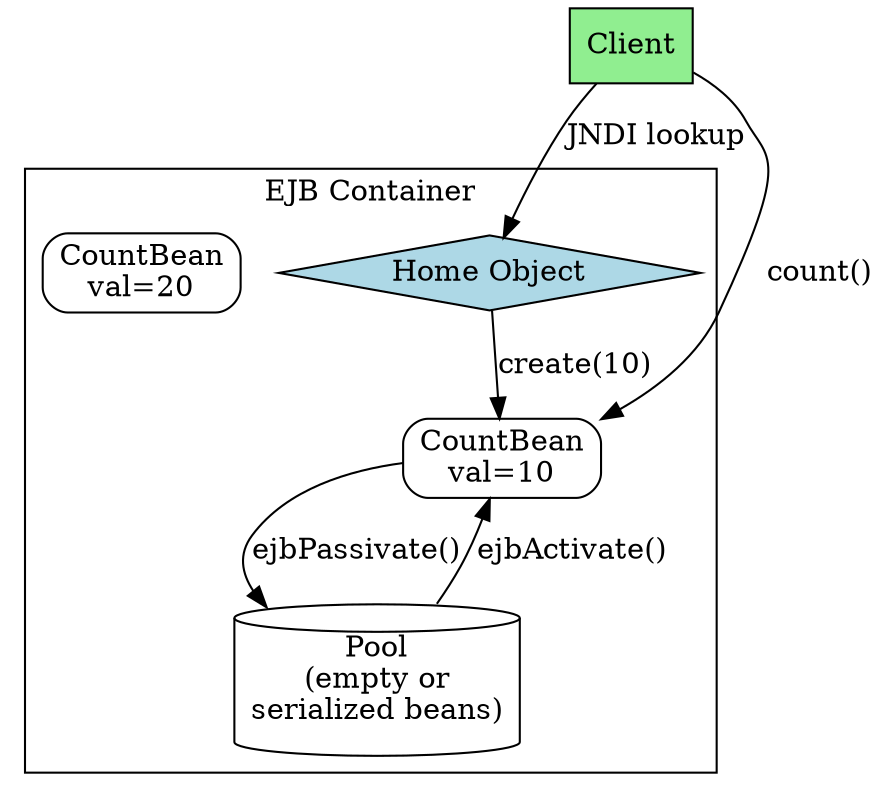

## The Problem
Learning EJB concepts abstractly is hard. Students need a concrete, minimal example that demonstrates stateful session beans, passivation/activation, and the full EJB lifecycle in action.

## Core Idea
The Count Bean is a simple stateful session bean example that maintains a conversational state (an integer counter `val`). It demonstrates the full EJB development cycle: remote interface, home interface, bean class, deployment descriptor, and client code.

## How It Works
1. **Remote Interface (`Count`)**: Extends `EJBObject`, declares `count()` business method that throws `RemoteException`
2. **Bean Class (`CountBean`)**: Implements `SessionBean`, has `val` as conversational state, implements `count()` to increment and return `val`
3. **Lifecycle Callbacks**: `ejbCreate(int val)` initializes state, `ejbPassivate()` serializes to storage, `ejbActivate()` restores from storage
4. **Home Interface (`CountHome`)**: Extends `EJBHome`, declares `create(int val)` which maps to `ejbCreate()`
5. **Deployment Descriptor**: Declares `<session-type>Stateful</session-type>` in `ejb-jar.xml`
6. **Client**: Looks up Home via JNDI, calls `home.create(10)`, calls `count()` to increment

The example shows passivation when pool limit (2 beans) is reached, then activation when beans are reused.

## Visual Explanation

## Key Properties
- **Stateful**: Maintains conversational state (`val`) across method calls
- **Passivation**: Bean serialized to storage when pool is full or idle
- **Activation**: Bean restored from storage when needed again
- **Serialiable state**: `val` is serialiable (primitive int)
- **JNDI lookup**: Client finds Home Object via JNDI, not `new`
- **No `this`**: Bean uses `SessionContext.getEJBObject()` to get self-reference

## Connections
- Built from: [[stateful-session-bean|Stateful Session Bean]] — CountBean is a stateful bean
- Built from: [[remote-interface|Remote Interface]] — Count interface extends EJBObject
- Built from: [[home-interface|Home Interface]] — CountHome is the factory
- Built from: [[passivation|Passivation]] — demonstrated when pool limit reached
- Built from: [[activation|Activation]] — demonstrated when bean reused
- Builds into: [[ejb-development-lifecycle|EJB Development Lifecycle]] — full example of the lifecycle
- Related: [[session-context|SessionContext]] — provides `getEJBObject()` for self-reference
- Related: [[instance-pooling|Instance Pooling]] — pool management triggers passivation

## Edge Cases & Gotchas
- **Stateful cannot be pooled**: Unlike stateless, each client gets dedicated bean
- **Passivation failure**: `val` must be serialiable, or passivation fails
- **`this` danger**: Never pass `this` to other beans—use `getEJBObject()`
- **Pool limit**: Container-specific setting controls when passivation occurs
- **Server crash**: Passivated state may be lost if server crashes

## Sources
- [[ejb6-summary|EJB6 Source Summary]]
