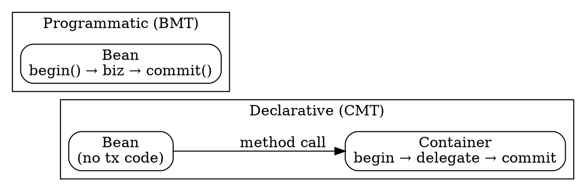

## The Problem
Developers need to control transaction boundaries (when they start and end), but writing transaction code in business logic is tedious and error-prone. There are two approaches: let the container handle it (declarative) or write it manually (programmatic).

## Core Idea
**Declarative (CMT):** Container automatically starts/commits transactions based on XML configuration — no transaction code in bean. **Programmatic (BMT):** Bean explicitly calls `begin()` and `commit()`/`abort()` in Java code. Session beans and MDBs can use either; entity beans MUST use CMT.

## How It Works

### Declarative (CMT)
1. Set `<transaction-type>Container</transaction-type>` in `ejb-jar.xml`
2. Container intercepts method call → calls `begin()` on transaction service
3. Delegates to bean for business logic
4. Bean returns (or signals abort via exception/`setRollbackOnly()`)
5. Container calls `commit()` or `abort()` on transaction service
6. Bean and client are unaware of transaction mechanics

### Programmatic (BMT)
1. Set `<transaction-type>Bean</transaction-type>` in `ejb-jar.xml`
2. Bean manually calls `begin()` at start of transaction
3. Bean performs business operations
4. Bean calls `commit()` or `abort()` at end
5. Full control over transaction boundaries — can have mini-transactions within a method

## Visual Explanation

## Key Properties

| Feature | Declarative (CMT) | Programmatic (BMT) |
|---|---|---|
| Transaction code | None in bean | Written in bean |
| Control | Container-managed | Developer-controlled |
| Mini-transactions | Not possible | Possible within a method |
| Bean types allowed | All (entity MUST use this) | Session + MDB only |
| Tuning | Via XML (no source access) | Via code changes |

## Connections
- Built from: [[transactions|Transactions]] — CMT and BMT are demarcation styles
- Built from: [[transaction-demarcation|Transaction Demarcation]] — the 3 ways to demarcate
- Builds into: [[entity-bean-transactions|Entity Bean Transaction Rules]] — entity beans MUST use CMT
- Related: [[message-driven-bean|MDB]] — MDBs can use BMT or CMT
- Related: [[session-bean|Session Bean]] — session beans can use BMT or CMT
- Contrasts with: [[client-initiated-transactions|Client-Initiated]] — third demarcation style

## Edge Cases & Gotchas
- Entity beans (BMP/CMP) CANNOT use BMT — it's illegal (container calls ejbLoad/ejbStore, not bean)
- BMT requires careful handling: forgetting commit() leaves transaction open
- CMT transactions apply to entire method (can't have mini-transactions)
- Client-initiated transactions are separate from BMT/CMT (client controls, bean still uses BMT/CMT internally)

## Sources
- [[EJb4-summary|EJb4.md Source Summary]]
