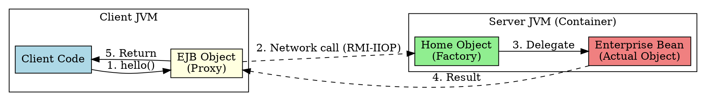

# Distributed Objects

## The Problem
Traditional objects live in a single JVM—if you want to call a method on an object running on a different server, you can't just use `object.method()`. Network programming is complex: you need sockets, serialization, protocol handling, and error recovery.

## Core Idea
A distributed object is a Java object running on a remote server, but it can be accessed as if it were local. The EJB container (via RMI-IIOP) handles all network complexity—the client calls methods on a proxy, and the container forwards the call to the actual object on the server.

## How It Works
1. **Server side**: The EJB object (proxy) is registered with the naming service (JNDI)
2. **Client lookup**: Client uses JNDI to find the home object reference
3. **Proxy creation**: Home object creates an EJB object (proxy) for the client
4. **Method invocation**: Client calls methods on the proxy; proxy forwards via network to the actual bean
5. **Result return**: Bean's response travels back through proxy to client

## Visual Explanation

## Key Properties
- Objects can be **accessed across network boundaries** (different machines, different JVMs)
- **Location transparency**: Client doesn't know or care where the object physically lives
- **RMI-IIOP protocol**: Standard wire protocol for EJB distributed objects
- **Proxy pattern**: Client never talks directly to the bean—always through EJB object

## Connections
- **Built from:** [[rmi-remote-method-invocation|RMI]], [[jndi|JNDI]], [[ejb-naming-service|EJB Naming Service]]
- **Builds into:** [[ejb-object|EJB Object]], [[home-interface|Home Interface]], [[distributed-objects|Distributed Objects]]
- **Related:** [[middleware|Middleware]] (handles network complexity), [[location-transparency|Location Transparency]] (clients don't know object location)
- **Contrasts with:** Local objects (in-process, no network overhead), [[local-home-interface|Local Home Interface]] (same JVM, no RMI)

## Edge Cases & Gotchas
- **Network failures**: Remote exceptions (`RemoteException`) can occur—not present with local objects
- **Serialization overhead**: Parameters must be serializable for network transfer
- **Latency**: Network calls are 100-1000x slower than in-process calls
- **Stateless beans preferred for distributed access**: No client-specific state to transfer

## Sources
- [[ejb5-summary|EJB5 Source Summary]]
