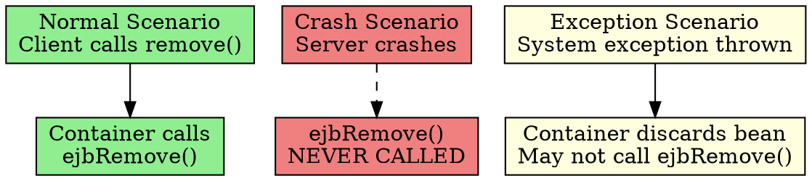

# Don't Rely on ejbRemove()

## The Problem
Developers often put critical cleanup code in `ejbRemove()`—closing database connections, deleting temporary shopping cart data, etc. But what if `ejbRemove()` is never called?

## Core Idea
The EJB container MAY call `ejbRemove()` when it decides to destroy a bean instance. BUT it is NOT guaranteed. If the server crashes, or if a critical system exception occurs, the bean is destroyed without `ejbRemove()` being called. Never rely on `ejbRemove()` for critical cleanup.

## How It Works
- **Normal case**: Container calls `ejbRemove()` when client calls `remove()` or when bean times out
- **Crash case**: Server crashes → `ejbRemove()` never called → resources leaked
- **Exception case**: System exception occurs → container discards bean → `ejbRemove()` may not be called

**Solution**: Use external cleanup utilities (e.g., a periodic job that deletes abandoned shopping carts from the database).

## Visual Explanation

## Key Properties
- **Not a destructor**: Unlike C++ destructors, `ejbRemove()` is not guaranteed
- **Container's choice**: EJB spec allows container to skip `ejbRemove()` in some cases
- **Periodic cleanup needed**: For resources that MUST be cleaned (like temp DB records), use a scheduled job
- **Session beans**: Stateless beans may be destroyed without `ejbRemove()` (pool management)

## Connections
- **Built from:** [[session-bean|Session Bean]], [[entity-bean|Entity Bean]] (both have `ejbRemove()`)
- **Builds into:** [[ejb-container|EJB Container]] (decides when to call it)
- **Related:** [[application-vs-system-exceptions|System Exceptions]] (can bypass `ejbRemove()`)
- **Contrasts with:** Java `finalize()` (also unreliable), C++ destructors (reliable)

## Edge Cases & Gotchas
- **Shopping cart example**: If `ejbRemove()` isn't called, abandoned carts stay in DB forever—need a cleanup job
- **Database connections**: Don't close them in `ejbRemove()`—use `ejbPassivate()` or let container manage pooling
- **Exam trick question**: "Where should you put critical cleanup code?" → Answer: Nowhere in the bean—use external utilities

## Sources
- [[ejb5-summary|EJB5 Source Summary]]
