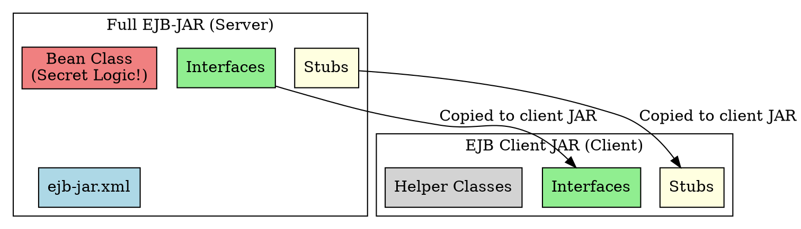

# EJB Client JAR

## The Problem
Clients need the EJB interfaces and stubs to call beans. But giving them the full EJB-JAR (which includes your business logic/bean class) is a security risk and wastes disk space. How can you give clients only what they need?

## Core Idea
The optional EJB Client JAR is a smaller archive containing only the files clients need: interfaces (Home, Remote/Local), helper classes, and generated stubs. You specify it in the deployment descriptor with `<ejb-client-jar>HelloClient.jar</ejb-client-jar>`. Clients deploy just this JAR, not the entire EJB-JAR.

## How It Works
1. **Developer creates Client JAR**: Bundles interfaces + stubs + helpers
2. **Declare in XML**: `<ejb-client-jar>` tag in `ejb-jar.xml`
3. **Deployer gives Client JAR to clients**: Clients add it to their classpath
4. **Client uses JAR**: Can lookup and call beans without having bean implementation

## Visual Explanation

## Key Properties
- **Optional**: Most deployments don't use it (hard disk space is cheap)
- **Security**: Hides business logic implementation from clients
- **Smaller footprint**: Useful for applets or disk-constrained environments
- **Declared in deployment descriptor**: Container tells deployer which JAR to create

## Connections
- **Built from:** [[home-interface|Home Interface]], [[remote-interface|Remote Interface]] (included in client JAR)
- **Builds into:** [[jndi|JNDI]] (client uses JAR to lookup beans)
- **Related:** [[ejb-jar-file|EJB-JAR File]] (the full version)
- **Contrasts with:** Full EJB-JAR (includes secret bean implementation)

## Edge Cases & Gotchas
- **Mostly obsolete**: Modern deployments use Web Services or REST—not EJB direct clients
- **Laziness prevails**: Most deployers just give clients the full EJB-JAR (easier)
- **Applet environment**: Only critical use case—applets have very limited disk space

## Sources
- [[ejb5-summary|EJB5 Source Summary]]
