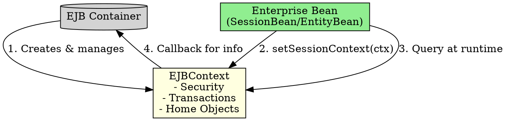

## The Problem
Enterprise beans live inside a managed container. Sometimes the bean needs to query the container—"Who is the current user?", "Is this transaction going to rollback?", "What's my home object?". But beans shouldn't directly access container internals.

## Core Idea
`EJBContext` is the bean's gateway to the container. It's an object that encapsulates everything the bean needs to know about its environment. The container injects this context (via `setSessionContext()` or `setEntityContext()`), and the bean can query it at any time.

## How It Works
The container calls `setSessionContext(SessionContext ctx)` during bean creation. The bean stores this reference. Later, the bean can use it:

- **Security**: `getCallerPrincipal()`, `isCallerInRole(String role)`
- **Transactions**: `getRollbackOnly()`, `setRollbackOnly()`, `getUserTransaction()`
- **Home access**: `getEJBHome()`, `getEJBLocalHome()`

## Visual Explanation



## Key Properties
- **Callback injection**: Container injects context via `setSessionContext()`—never created by bean
- **Dynamic**: Context changes over bean's lifecycle (e.g., transaction status changes)
- **Two types**: `SessionContext` (for session beans), `EntityContext` (for entity beans)
- **Environment bridge**: Bean can access JNDI environment entries via context

## Connections
- **Built from:** [[ejb-container|EJB Container]] (provides the context)
- **Builds into:** [[transactions|Transactions]] (via `setRollbackOnly()`)
- **Related:** [[session-bean|Session Bean]], [[entity-bean|Entity Bean]]
- **Contrasts with:** Regular Java objects (no container, no context)

## Edge Cases & Gotchas
- **Don't store context in static variables**: Context is per-bean-instance, static is shared
- **Context valid only inside container**: Can't use it outside container-managed methods
- **Null check**: Always check if context is set before using (during `ejbCreate()` it's already set)

## Code Example
```java
public class HelloBean implements SessionBean {
    private SessionContext ctx;

    public void setSessionContext(SessionContext ctx) {
        this.ctx = ctx;
    }

    public String hello() {
        // Who is calling?
        Principal caller = ctx.getCallerPrincipal();
        // Am I in a transaction that will rollback?
        boolean rollback = ctx.getRollbackOnly();
        return "Hello, " + caller.getName();
    }
}
```

## Sources
- [[ejb5-summary|EJB5 Source Summary]]
