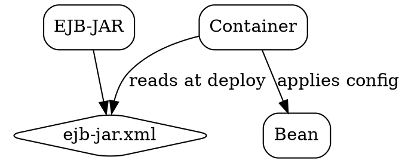

## The Problem
How do we configure bean behavior (transactions, security, resource references) without changing Java code? The bean provider shouldn't hardcode these, and the deployer should be able to configure them at deployment time.

## Core Idea
The Deployment Descriptor is an XML file (ejb-jar.xml) that declares how an Enterprise Bean should behave in the container. It configures transaction attributes, security roles, container-managed fields, and other deployment-specific settings declaratively.

## How It Works
1. Bean is packaged in EJB-JAR with deployment descriptor (META-INF/ejb-jar.xml)
2. Container reads deployment descriptor during deployment
3. Container applies configurations to the bean:
   - Transaction attributes
   - Security roles and permissions
   - Container-managed fields (for CMP)
   - Resource references (datasources, etc.)
4. Descriptor overrides default behaviors
5. For EJB 3.x: Many settings move to annotations, but DD still used

## Visual Explanation

## Key Properties
- XML-based: Standard format (ejb-jar.xml in EJB 2.x)
- Declarative: No Java code changes needed
- Container-managed: Container interprets and applies
- Transaction attributes: REQUIRED, REQUIRES_NEW, NOT_SUPPORTED, etc.
- Security roles: Who can access which methods
- Portable: Standard format across application servers
- Overridden by annotations in EJB 3.x

## Connections
- Built from: [[ejb-container|EJB Container]] — interprets deployment descriptor
- Configures: [[container-managed-persistence|Container-Managed Persistence]] — can specify CMP fields
- Configures: [[transaction-attribute|Transaction Attribute]] — transaction behavior
- Related: [[ejb-jar|EJB JAR]] — packaging format
- Related: [[ejb-ql|EJB-QL]], [[cdata-hack|CDATA Hack]], [[declarative-vs-programmatic-transactions|CMT vs BMT]], [[cmp-abstract-accessors|CMP Abstract Accessors]], [[one-to-one-relationship|One-to-One]], [[many-to-many-relationship|M:N Relationships]]

## Edge Cases & Gotchas
- EJB 3.x reduces need for DD with annotations
- Some settings can be specified in both DD and annotations (precedence varies)
- Different servers may have server-specific descriptors
- Descriptor errors can cause deployment failures
- Security: Ensure DD is not world-readable in production