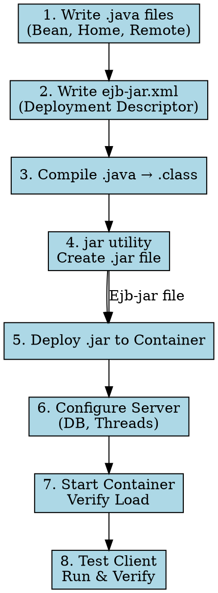

## The Problem
Building an EJB component involves more than just writing Java code. You need to compile, package, configure, and deploy—missing any step results in a non-functional component. What's the correct order?

## Core Idea
The EJB development lifecycle is an 8-step process from raw Java files to a running, tested component in the container. Each step has a specific purpose and must be done in order.

## How It Works

1. **Write Java files**: Component interfaces, home interfaces, bean class, helper classes
2. **Write deployment descriptor**: `ejb-jar.xml` with bean metadata (or use IDE/XDoclet to generate)
3. **Compile**: `javac` to convert `.java` → `.class`
4. **Create EJB-JAR**: Use `jar` utility to package `.class` files + `ejb-jar.xml`
5. **Deploy**: Copy JAR to container's deployment folder or use vendor tools
6. **Configure**: Set database connections, thread pools via vendor console/config files
7. **Start container**: Verify the JAR loaded successfully
8. **Test**: Write a client, generate stubs, compile, run, and verify

## Visual Explanation

## Key Properties
- **Standardized process**: Every EJB component follows these steps (vendor-neutral)
- **Step 5 is vendor-specific**: Each container has its own deployment mechanism
- **Step 6 is vendor-specific**: Configuration differs (Web console vs config files)
- **Deployment descriptor is key**: Tells container how to manage the bean

## Connections
- **Built from:** [[ejb-deployment-descriptor|Deployment Descriptor]], [[home-interface|Home Interface]], [[remote-interface|Remote Interface]]
- **Builds into:** [[ejb-object|EJB Object]] (generated in step 5), [[ejb-container|EJB Container]]
- **Related:** [[ejb-jar-file|EJB-JAR File]] (output of step 4)
- **Contrasts with:** Simple Java app (just compile and run—no deployment descriptor needed)

## Edge Cases & Gotchas
- **Forgetting step 2**: Without `ejb-jar.xml`, container doesn't know about your beans
- **Classpath issues**: Step 3 needs EJB APIs (javax.ejb.*) in classpath
- **Vendor tools automate**: Modern IDEs (Eclipse, IntelliJ) automate steps 2-4

## Sources
- [[ejb5-summary|EJB5 Source Summary]]
