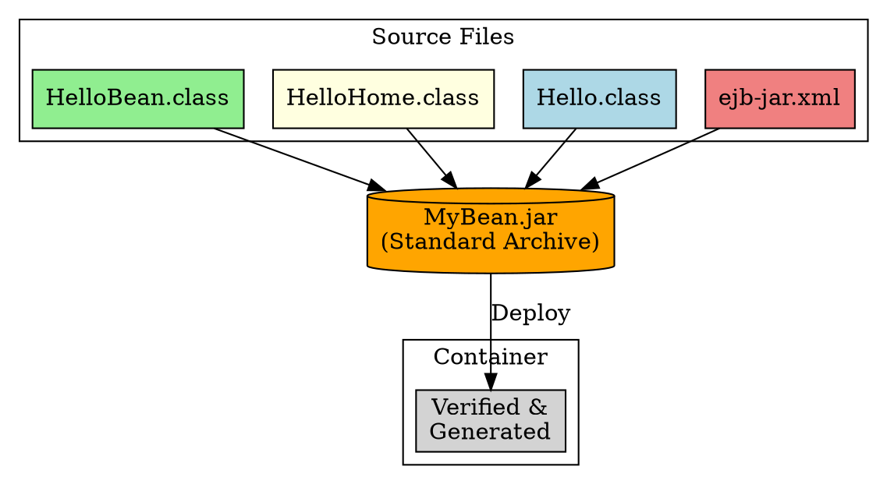

## The Problem
You've written your bean class, interfaces, and deployment descriptor. How do you package them for deployment to any EJB container? You need a standard format that bundles everything together.

## Core Idea
The EJB-JAR file is a standard Java archive (`.jar`) containing all the classes (bean class, home/remote/local interfaces, helpers) plus the `ejb-jar.xml` deployment descriptor. This single file is what you deploy to the container—it's vendor-neutral and portable.

## How It Works
1. **Compile**: `javac` converts `.java` → `.class` for all your files
2. **Package**: `jar cvf MyBean.jar *.class ejb-jar.xml` creates the archive
3. **Deploy**: Copy JAR to container's deployment folder or use vendor tools
4. **Container verifies**: Checks the JAR structure and generates EJB Object/Home Object

## Visual Explanation

## Key Properties
- **Standard format**: Any EJB container can read an EJB-JAR file
- **Contains**: Classes + `META-INF/ejb-jar.xml` (deployment descriptor)
- **Optional**: May include `META-INF/webservices.xml` or vendor-specific files
- **Vendor-neutral**: Write once, deploy on any EJB container

## Connections
- **Built from:** [[home-interface|Home Interface]], [[remote-interface|Remote Interface]], [[ejb-deployment-descriptor|Deployment Descriptor]]
- **Builds into:** [[ejb-verification-generation|EJB Verification & Generation]] (container processes the JAR)
- **Related:** [[ejb-client-jar|EJB Client JAR]] (subset of files for clients)
- **Contrasts with:** Regular JAR (no `ejb-jar.xml`, not deployable to EJB container)

## Edge Cases & Gotchas
- **Missing `ejb-jar.xml`**: Container rejects the JAR—deployment fails
- **Classpath issues**: All dependencies must be in the JAR or server classpath
- **Vendor-specific files**: Some containers need extra files in `META-INF/` (e.g., `weblogic-ejb-jar.xml`)