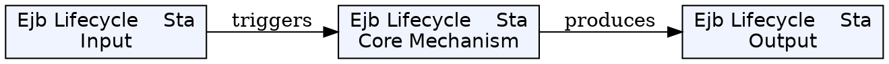
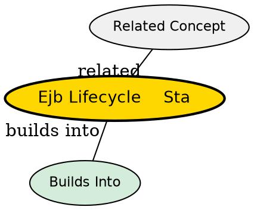

## The Problem

What states does a stateful session bean go through, including passivation and activation?

## Core Idea

The stateful session bean lifecycle has four states: Does Not Exist, Ready, Passive, and being removed. Passivation and activation are unique to stateful beans for memory management.

## How It Works

### 1. Does Not Exist

- Bean instance does not exist in memory

### 2. Creation

- Client calls create() on home interface
- Container creates instance, calls setSessionContext(), calls ejbCreate()
- Bean enters Ready state, dedicated to this client

### 3. Ready State

- Client calls business methods on the bean
- Bean retains conversational state for this client

### 4. Passivation (Ready → Passive)

- Container invokes ejbPassivate() callback
- Bean serializes its state to storage
- Bean instance removed from memory
- Triggered when container reaches instance limit

### 5. Activation (Passive → Ready)

- Client calls method on passivated bean
- Container deserializes state, creates/reuses instance
- Container invokes ejbActivate() callback
- Bean returns to Ready state

### 6. Destruction

- Client calls remove() OR client times out
- Container calls ejbRemove()
- Bean destroyed, data removed from database

## Key Properties

- Supports passivation/activation for memory efficiency
- No instance pooling (dedicated to one client)
- ejbCreate() can accept client-specific parameters

## Visual Explanation

## Semantic Network

## Connections

- Built from: [[stateful-session-bean|Stateful Session Bean]]
- Related: [[passivation|Passivation]], [[activation|Activation]], [[ejbpassivate|ejbPassivate()]], [[ejbactivate|ejbActivate()]]

## Edge Cases & Gotchas

- Don't rely on ejbRemove() or ejbPassivate() for critical cleanup
- External resources (DB connections) should be released in passivate and re-acquired in activate