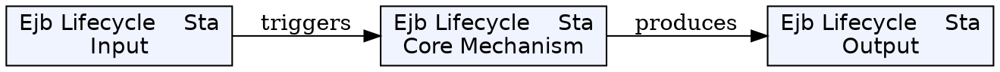
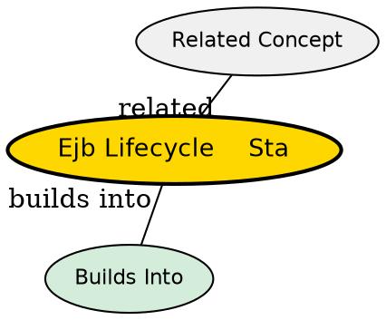

## The Problem

What happens to a stateless session bean from creation to destruction?

## Core Idea

The stateless session bean lifecycle has three states: Does Not Exist, Method-Ready Pool, and being removed. The container manages all transitions.

## How It Works

### 1. Does Not Exist

- Bean instance does not exist in memory

### 2. Creation (Entering Pool)

- Container calls Class.newInstance() to create instance
- Container calls setSessionContext() to associate bean with container
- Container calls ejbCreate() to initialize bean
- Bean enters the "Method-Ready Pool" of equivalent instances

### 3. Method Ready (In Pool)

- Container can call any business method
- Any instance can serve any client
- Each method call may be handled by a different instance

### 4. Destruction

- Container calls ejbRemove() when bean is destroyed
- Bean returns to Does Not Exist state
- ejbRemove() is a cleanup method--release resources

## Key Properties

- No passivation/activation (stateless has no state to serialize)
- All instances in pool are equivalent
- Container controls creation and destruction
- ejbCreate() takes no parameters (no client-specific init data)

## Visual Explanation

## Semantic Network

## Connections

- Built from: [[stateless-session-bean|Stateless Session Bean]]
- Related: [[instance-pooling|Instance Pooling]], [[ejbcreate|ejbCreate()]], [[ejbremove|ejbRemove()]]

## Edge Cases & Gotchas

- Don't rely on ejbRemove()--it may never be called if container crashes
- Stateless beans can be pre-created at startup (not lazily created)