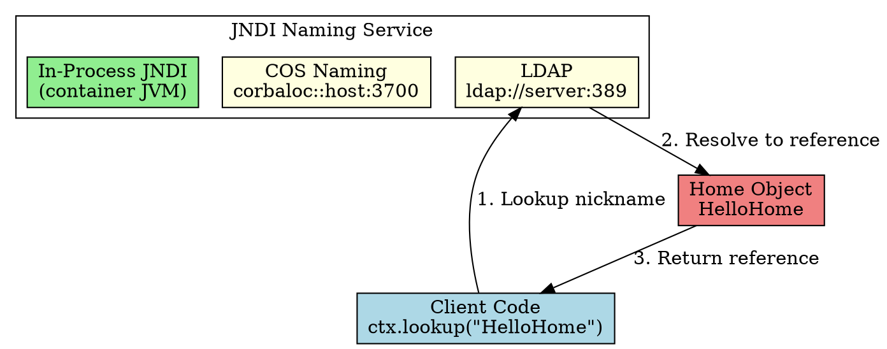

## The Problem
Clients need to find Home Objects to create beans. But hardcoding server addresses in client code creates tight coupling—if the server moves, all clients break. What's the solution?

## Core Idea
EJB uses naming and directory services (via JNDI) to store and look up resources (Home Objects, environment properties, database drivers) by logical name (nickname), not physical address. Clients use `ctx.lookup("HelloHome")` to find Home Objects—the naming service resolves the actual location.

## How It Works
1. **Deployer binds nickname**: Container registers Home Object with JNDI using a name (e.g., `"HelloHome"`)
2. **Client sets up JNDI properties**: `Context.INITIAL_CONTEXT_FACTORY` + `Context.PROVIDER_URL`
3. **Client looks up**: `ctx.lookup("HelloHome")` → JNDI returns Home Object reference
4. **Naming service types**: LDAP, CORBA Naming Service (COS Naming), or in-process JNDI tree

## Visual Explanation

## Key Properties
- **Location transparency**: Client doesn't know physical server address
- **Standard API**: JNDI (`javax.naming.*`) works with any naming service
- **JNDI properties**: `INITIAL_CONTEXT_FACTORY` (e.g., `com.sun.jndi.ldap.LdapCtxFactory`) + `PROVIDER_URL` (e.g., `ldap://louvre:389`)
- **Beyond Home Objects**: Also stores environment properties, database resources, message queues

## Connections
- **Built from:** [[jndi|JNDI]], [[location-transparency|Location Transparency]]
- **Builds into:** [[home-interface|Home Interface]] (what gets looked up)
- **Related:** [[distributed-objects|Distributed Objects]] (clients access objects via naming)
- **Contrasts with:** RMI Registry (limited to RMI, not generalized naming)

## Edge Cases & Gotchas
- **JNDI properties are environment-specific**: Different containers need different factory/URL settings
- **Network partition**: If naming service is unreachable, all lookups fail
- **Nickname collisions**: Two beans with same JNDI name cause deployment errors