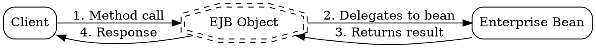

# EJB Object

## The Problem
When a client on a different machine wants to call a method on an Enterprise Bean, how does the remote call actually happen? Direct object references from one JVM cannot be used in another JVM — memory addresses are meaningless across machines. We need an abstraction layer that handles remote communication transparently.

## Core Idea
The EJB Object is a container-generated stub that acts as a proxy between the client and the actual Enterprise Bean. It wraps the bean, intercepts method calls, and handles all the RMI communication under the hood.

## How It Works
1. Container automatically generates the EJB Object when the bean is deployed
2. Client never accesses the bean directly — always goes through the EJB Object
3. When client calls a method, EJB Object:
   - Serializes the method parameters
   - Sends the request over network (using RMI-IIOP)
   - Forwards to actual bean instance
   - Serializes the response
   - Returns to client
4. The EJB Object also handles:
   - Transaction demarcation
   - Security checks
   - Life cycle management

The client holds a reference to the EJB Object, not the actual bean.

## Visual Explanation

## Key Properties
- Container-generated: Automatically created by the EJB container at deployment time
- Remote proxy: Handles all network communication transparently
- Thread-safe: Manages concurrency for the bean
- Transaction-aware: Can automatically start/commit/rollback transactions
- Security-aware: Enforces role-based access before delegating to bean

## Connections
- Built from: [[ejb-container|EJB Container]] — the container creates and manages EJB Objects, [[ejb-verification-generation|EJB Verification & Generation]] (container generates it)
- Built from: [[rmi-remote-method-invocation|RMI Remote Method Invocation]] — uses RMI for network communication, [[home-interface|Home Interface]] (factory creates it)
- Builds into: [[session-bean|Session Bean]] — wraps session bean instances, [[application-vs-system-exceptions|Application vs System Exceptions]] (it intercepts exceptions)
- Builds into: [[entity-bean|Entity Bean]] — wraps entity bean instances
- Related: [[home-object|Home Object]] — both are part of the bean access architecture, [[business-interface-pattern|Business Interface Pattern]] (it implements the remote interface + business interface)
- Related: [[remote-interface|Remote Interface]] — defines what methods the client can call, [[why-bean-doesnt-implement-interface|Why Bean Doesn't Implement Component Interface]] (bean shouldn't implement EJB Object's interface directly)

## Edge Cases & Gotchas
- Client never holds direct reference to bean — always through EJB Object
- If container fails, EJB Object cannot communicate with bean
- EJB Object pooling is possible for stateless beans, but each stateful bean has its own EJB Object
- The "EJB Object" is conceptually similar to a Stub in RMI

## Sources
- [[ejb3-summary|EJB3 Source Summary]]