# EJB Query Language (EJB-QL)

## The Problem
In Container-Managed Persistence (CMP), the developer does not write SQL in Java code. The container generates persistence code automatically, but it still needs to know how to query the database. Without a query language, there's no way to define finder queries in CMP without falling back to writing raw SQL in the bean class.

## Core Idea
EJB-QL is an object-oriented query language used in CMP deployment descriptors to define finder and select queries. Unlike SQL which operates on tables and columns, EJB-QL operates on EJB abstract persistent fields and relationships.

## How It Works
1. Queries are written in `ejb-jar.xml` deployment descriptor, not in Java code
2. Syntax: `SELECT OBJECT(p) FROM PRODUCTS p WHERE p.basePrice > ?1`
3. `p` represents the bean abstract schema, not a database table
4. `?1` is a positional parameter passed from the finder method
5. Queries are parsed by the container and converted to actual SQL at deployment or runtime
6. Because XML uses `<` and `>` for tags, comparison operators must be wrapped in `<![CDATA[ ... ]]>` to avoid parser errors

## Visual Explanation

```dot
digraph G {
    rankdir=LR;
    node [shape=box, style=rounded];
    
    JavaBean [label="CMP Bean\n(Java Code)"];
    DD [label="ejb-jar.xml\nDeployment Descriptor"];
    EJBQL [label="EJB-QL Query\nOBJECT(p) FROM PRODUCTS\nWHERE p.basePrice > ?1"];
    Container [label="EJB Container"];
    SQL [label="Generated SQL\nSELECT * FROM products\nWHERE base_price > ?"];
    DB [label="Database"];
    
    JavaBean -> DD [label="deploy"];
    DD -> EJBQL;
    EJBQL -> Container [label="parse & transform"];
    Container -> SQL;
    SQL -> DB;
}
```

## Key Properties
- Object-oriented: operates on bean abstract schema names, not table/column names
- Defined in deployment descriptor, not Java source code
- Supports positional parameters (`?1`, `?2`, etc.) for parameterized queries
- Requires CDATA wrapping for comparison operators in XML
- Container translates EJB-QL to vendor-specific SQL

## Connections
- Built from: [[container-managed-persistence|CMP]] — EJB-QL is exclusive to CMP beans
- Builds into: [[cmp-abstract-accessors|CMP Abstract Accessors]] — EJB-QL queries are used by finder methods defined via abstract accessors
- Contrasts with: [[jdbc|JDBC/SQL]] — EJB-QL is object-based and in XML; SQL is table-based and in Java code (BMP)
- Related: [[ejb-deployment-descriptor|EJB Deployment Descriptor]] — EJB-QL queries live inside the deployment descriptor
- Related: [[cdata-hack|CDATA Hack]] — XML escaping needed for EJB-QL operators

## Edge Cases & Gotchas
- Forgetting CDATA wrapping causes XML parsing errors on operators like `>`, `<`, `>=`
- EJB-QL syntax differs from JPQL (Java Persistence Query Language) in later JPA specs
- EJB-QL only works with CMP 2.0+ entity beans; BMP beans use raw JDBC
- Queries are validated at deployment time, not at compile time

## Sources
- [[EJb4-summary|EJb4.md Source Summary]]
