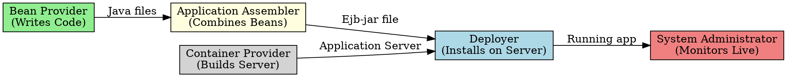

## The Problem
Large enterprise software projects involve multiple stakeholders with different responsibilities. Without clear role separation, code, deployment, and operations become chaotic—developers might hardcode server paths, or deployers might not know which security settings to apply.

## Core Idea
EJB formalizes the software development lifecycle by dividing it into distinct roles, each with clear responsibilities. This separation of concerns ensures that code is portable, reusable, and professionally managed.

## How It Works
The EJB specification defines these roles:

| Role | Responsibility |
|------|-----------------|
| **Bean Provider** | Writes the Java code (Bean Class, Interfaces) and business logic |
| **Application Assembler** | Combines multiple beans into a complete application |
| **EJB Deployer** | Installs and configures the application on the server |
| **System Administrator** | Monitors the live system, ensures server health |
| **Container/Server Provider** | Builds the application server (e.g., Oracle, IBM, JBoss) |

## Visual Explanation

## Key Properties
- **Bean Provider** only writes business logic—never server-specific code
- **Application Assembler** doesn't need to know implementation details of each bean
- **Deployer** uses vendor-specific tools but deploys standard EJB-JAR files
- **Portability**: Code written by Bean Provider runs on any EJB container

## Connections
- **Built from:** [[ejb-deployment-descriptor|Deployment Descriptor]] (used by Deployer)
- **Builds into:** [[ejb-container|EJB Container]] (provided by Container Provider)
- **Related:** [[session-bean|Session Bean]], [[entity-bean|Entity Bean]] (created by Bean Provider)
- **Contrasts with:** Monolithic development (no role separation)

## Edge Cases & Gotchas
- In small teams, one person may wear multiple roles (Bean Provider + Assembler + Deployer)
- Container Provider role is only for big vendors (Oracle, IBM, Red Hat)—most developers are Bean Providers
- Miscommunication between Assembler and Deployer causes deployment failures