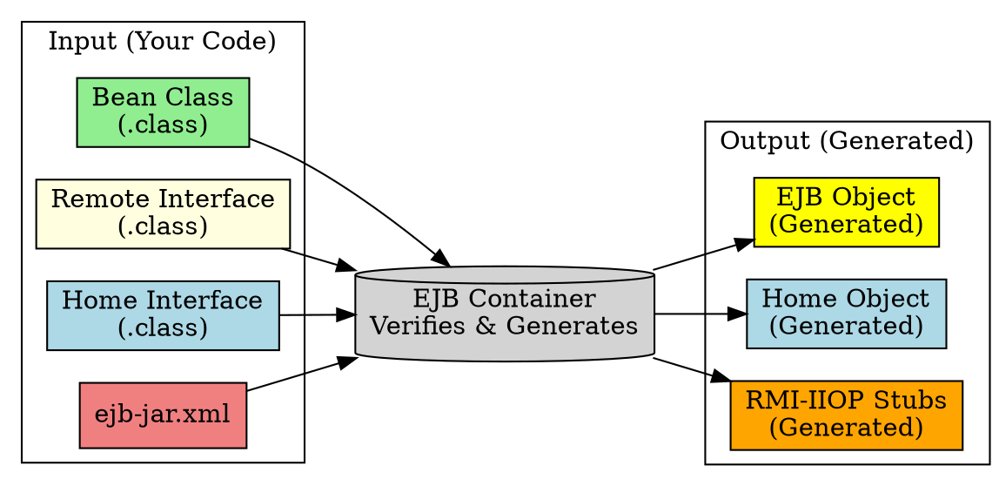

# EJB Verification & Generation

## The Problem
After deploying an EJB-JAR file, how does the container ensure your bean is valid? And who writes the EJB Object and Home Object code—you or the container?

## Core Idea
When you deploy an EJB-JAR, the container performs two critical tasks:
1. **Verification**: Checks that your bean class, interfaces, and deployment descriptor are valid (reports errors like "missing `ejbCreate()` method")
2. **Generation**: Automatically creates the EJB Object and Home Object implementations (plus RMI-IIOP stubs/skeletons)—you only write the interfaces, the container writes the actual classes

## How It Works

**Verification checks:**
- Bean class implements the correct interface (`SessionBean`, `EntityBean`)
- `ejbCreate()` method exists and matches home interface's `create()`
- Deployment descriptor is well-formed XML
- All required exceptions are declared

**Generation outputs:**
- EJB Object class (implements your Remote Interface)
- Home Object class (implements your Home Interface)
- RMI-IIOP stubs (for remote clients) and skeletons

## Visual Explanation

## Key Properties
- **You never write EJB Object or Home Object code**: Container generates them from your interfaces
- **Verification prevents runtime errors**: Catch missing methods before the bean is used
- **Vendor-specific generation**: Each container has its own tools (sometimes proprietary)
- **Intelligent error reporting**: Commercial tools tell you exactly what's wrong

## Connections
- **Built from:** [[home-interface|Home Interface]], [[remote-interface|Remote Interface]], [[ejb-deployment-descriptor|Deployment Descriptor]]
- **Builds into:** [[ejb-object|EJB Object]], [[home-interface|Home Object]] (generated)
- **Related:** [[ejb-development-lifecycle|EJB Development Lifecycle]] (step 5: deploy triggers this)
- **Contrasts with:** Regular Java (no verification, no generation—you write everything)

## Edge Cases & Gotchas
- **Generated classes are container-specific**: You can't take JBoss-generated stubs and use them on WebLogic
- **Verification happens at deployment, not compile time**: Your code compiles fine, but deployment fails
- **Some containers generate lazily**: EJB Object might be generated on first client lookup, not at deployment

## Sources
- [[ejb5-summary|EJB5 Source Summary]]
